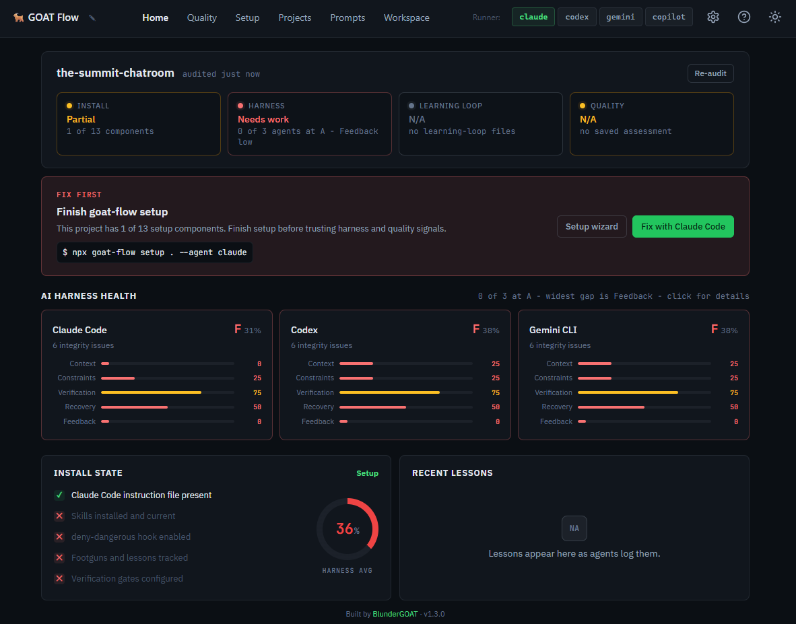

# GOAT Flow

**A dashboard for auditing, configuring, and running your AI coding agents.**

One command opens a local menu for auditing, deterministic setup, guided agent prompts, and the dashboard. The manifest-backed support matrix currently covers Claude Code, Codex, Gemini CLI, and Copilot CLI.

[](https://www.npmjs.com/package/@blundergoat/goat-flow) [](LICENSE) 

```bash
npx @blundergoat/goat-flow@latest
```
output:
```text
What do you want to do?
  1. Start dashboard
  2. Install/update goat-flow files
  3. Generate setup prompt
  4. Audit current project
  5. Show project status
```

**Install locally (optional)**

```bash
npm install --save-dev @blundergoat/goat-flow    # npm
```

then run this for the dashboard:

```bash
npx goat-flow dashboard .
```

For the dashboard's embedded terminal, you'll need `node-pty` to compile. See [Troubleshooting](#troubleshooting) if the terminal doesn't appear.

## Dashboard views



The desktop dashboard uses a persistent side menu for primary navigation. The
header keeps the current project switcher, runner switcher, and utility actions
available while you move between views.

### Home

Live audit results for every supported agent. Per-agent cards show pass/fail across two scopes (GOAT Flow Setup, Agent Setup) with actionable fix hints. An AI Harness section scores each agent across five concerns - Context, Constraints, Verification, Recovery, and Feedback Loop - so you can see exactly where your setup is strong and where it's weak. "What to do next" action cards surface the highest-priority gaps. Re-audit after changes without leaving the page.

### Plans

Plan milestone view for the selected project. Surfaces `.goat-flow/tasks/` plan
directories, milestone status, and checkbox progress, and lets you set the
active plan.

### Setup

Guided setup flow. Detects your project stack and existing configuration, lets you pick a target agent, then generates a setup prompt you can preview and launch directly in a terminal session. The agent configures your project: instruction file, skills, hooks, and learning loop.

### Prompts

A library of 24 visible preset prompts across six categories: critique, debug, plan, QA, review, and security, plus 2 internal quality prompts used by dashboard workflows. Two-pane layout with search, category filters, and favorites. Select a prompt and launch it in a new terminal, send it to an active session, or copy it to clipboard. Keyboard-navigable: `/` to search, arrows to browse, Enter to launch.

Prompts include structured workflows like pre-walk-through notes with targeted testing plans, multi-lens critiques, full threat assessments, dependency scans, coverage audits, and milestone planning.

### Workspace

Split layout for terminal work. A sessions rail lists all running terminal sessions (up to 10) with runner, age, and idle indicators, plus collapsed-rail tooltips and an active-session status pip. Single-click switching between sessions. The right pane is a full xterm.js terminal with WebSocket-based PTY - run Claude, Codex, Gemini, or Copilot directly in the browser. Drag and drop images onto the terminal pane to attach them to the next prompt.

### Projects

Multi-project browser. Register multiple projects, view their audit status at a glance, and "Audit All" in one click. Titles and favorites follow a stable identity where possible: git remote hash first, then a local `.goat-flow/project-id` marker for non-git goat-flow projects, then path fallback. Select a project to switch context across the entire dashboard.

### Quality

Generate agent quality-assessment prompts. Select a target agent, generate the prompt, and preview the full output with embedded audit results.

## What's under the hood

The dashboard is the interface. Underneath, GOAT Flow installs a harness that makes agents more reliable:

| Component | What it prevents |
|---|---|
| **Execution Loop** (READ → SCOPE → ACT → VERIFY) | Guessing at unread code, shipping without checks |
| **Skills** (six `/goat-*` commands + dispatcher) | Free-form prompting that drifts mid-task |
| **Enforcement Hooks** (`deny-dangerous.sh`) | `rm -rf`, all git push, secret file access |
| **Learning Loop** (footguns, lessons, decisions) | Same mistake recurring next session |
| **Autonomy Tiers** (Always / Ask First / Never) | Agent overreach, missed approvals |

Skills have phases and human gates. Hooks intercept tool calls before they execute. The learning loop gets read at session start so mistakes compound into context, not repetition.

## Why not just CLAUDE.md / Cursor rules?

Instruction files tell the agent what to do. They don't enforce it.

|  | Instruction file alone | GOAT Flow |
|---|---|---|
| Tell the agent the rules | yes | yes |
| Block dangerous commands at tool level | no | yes |
| Structured workflows with human gates | no | yes |
| Capture lessons across sessions | no | yes |
| Audit whether setup is actually correct | no | yes |

Use an instruction file for rules the agent should *remember*. Use GOAT Flow for rules the agent cannot *skip*.

## Getting started

Requires Node.js 20+.

### 1. Start with the menu

```bash
npx @blundergoat/goat-flow@latest
```

No install required. Choose dashboard, deterministic install/update, setup prompt generation, audit, or status from the menu.

### 2. Install/update system files

For a brand new project, copy the goat-flow system files first. This step is deterministic and does not require an agent:

```bash
npx @blundergoat/goat-flow@latest install . --agent claude
```

Use `--force` only when you want to overwrite existing settings, `.goat-flow/config.yaml`, and remove deprecated skills. For outdated or v0.9 projects, the installer automatically updates the config version and cleans deprecated skill directories.

The installer keeps `.goat-flow/config.yaml` free of agent allowlists by default. Dashboard Home and aggregate `goat-flow audit .` read the supported agent registry from `workflow/manifest.json`, so they always show or check the current manifest-backed setup status. Use `--agent <id>` when you intentionally want one agent.

The install includes `.goat-flow/skill-reference/` for shared meta references and `.goat-flow/skill-playbooks/` for tool/capability playbooks. Generated or repaired instruction files route agents to `.goat-flow/skill-playbooks/` before declaring a requested tool unavailable.

### 3. Generate the setup prompt

The installer copies shared system files. The setup prompt still creates or refreshes project-specific content such as the instruction file, architecture, code map, and real project footguns/lessons.

```bash
npx @blundergoat/goat-flow@latest setup . --agent claude
```

Equivalent deterministic setup/update command:

```bash
npx @blundergoat/goat-flow@latest setup . --agent claude --apply
```

### 4. Re-audit

Back on the Home view, click **Re-audit**. All checks should pass. The AI Harness cards now show scores across the five concerns.

### 5. Use a prompt

Open the **Prompts** view, pick a workflow (code review, bug diagnosis, UI debugging with browser evidence, security assessment, test planning), and launch it in a terminal session. Each prompt invokes a structured `/goat-*` skill with phases and human gates.

## Multi-agent support

GOAT Flow's current manifest-backed registry supports **Claude Code, Codex, Gemini CLI, and Copilot CLI**. All agents share the same execution loop, autonomy tiers, skills, and learning loop. The dashboard's runner switcher in the header lets you toggle between agents and see per-agent audit results side by side.

Run `npx @blundergoat/goat-flow@latest manifest` to inspect the live agent matrix from `workflow/manifest.json`.

## CLI commands

The dashboard covers most workflows visually. For CI or scripting, the same features are available as CLI commands:

```bash
npx goat-flow dashboard .                  # Launch the dashboard
npx goat-flow audit .                      # Run audit (pass/fail output)
npx goat-flow audit . --harness            # Add AI harness scoring
npx goat-flow audit . --format json        # JSON output for CI
npx goat-flow audit . --format sarif       # SARIF output for code scanning upload
npx goat-flow install . --agent claude     # Copy/update system files
npx goat-flow setup . --agent claude       # Generate setup prompt
npx goat-flow quality . --agent claude     # Generate quality-assessment prompt
npx goat-flow status .                     # Project state (bare/partial/v0.9/outdated/current/error)
npx goat-flow manifest                     # Agent support matrix
```

The dashboard prints a tokenized localhost URL. Open that URL from the terminal output; the token is process-local and is removed from the visible address bar after the page boots.

See [docs/cli.md](docs/cli.md) for the full reference.

## The five harness concerns

Every major source in harness engineering (Hashimoto, Fowler/Böckeler, Anthropic, HumanLayer) converges on the same concerns. The dashboard's AI Harness section scores each agent across all five:

| Concern | Question |
|---------|----------|
| **Context** | Is the agent's context accurate, lean, and useful? |
| **Constraints** | Do deterministic rules catch failures before the LLM runs? |
| **Verification** | Can the agent verify its work, and does failure feed back? |
| **Recovery** | Can the agent resume after crash or interruption? |
| **Feedback Loop** | Is the harness getting smarter from failures over time? |

See [docs/audit-and-quality.md](docs/audit-and-quality.md) for the full framework and sources.

## Troubleshooting

**Terminal not showing in dashboard?**
goat-flow installs without a C++ toolchain as of v1.2.4. If you need the dashboard's embedded terminal, you'll also need `node-pty` to compile. Install build tools (`sudo apt install build-essential python3` on Debian/Ubuntu, `xcode-select --install` on macOS), then run `npm rebuild node-pty`. To skip the native build entirely: `npm install @blundergoat/goat-flow --omit=optional`.

**Audit fails on a fresh project?**
Expected. Run `npx @blundergoat/goat-flow@latest install . --agent claude`, then generate the setup prompt with `npx @blundergoat/goat-flow@latest setup . --agent claude`.

**Audit still fails after setup?**
Re-run `npx @blundergoat/goat-flow@latest audit . --verbose` to see which check failed. The `howToFix` hint on each failure points at the missing file or config key.

**Agent isn't following the execution loop?**
Restart the agent session after setup so it re-reads the instruction file. Agents only pick up instruction-file changes on session start.

**Setup prompt looks wrong or incomplete?**
Regenerate from the dashboard Setup page, which shows detected stack info alongside the prompt.

## Documentation

| Document | What it covers |
|---|---|
| [CLI Reference](docs/cli.md) | All commands, flags, and output formats |
| [Dashboard](docs/dashboard.md) | Views, terminal, API endpoints |
| [Skills Reference](docs/skills.md) | All 7 skills: modes, phases, gates, outputs |
| [Audit & Quality](docs/audit-and-quality.md) | The two evaluation commands, 5 harness concerns, and when to use each |

## Author

Built by [Matthew Hansen](https://www.blundergoat.com/about).

## License

[MIT](LICENSE)
