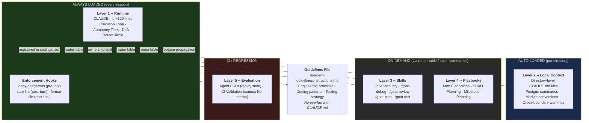
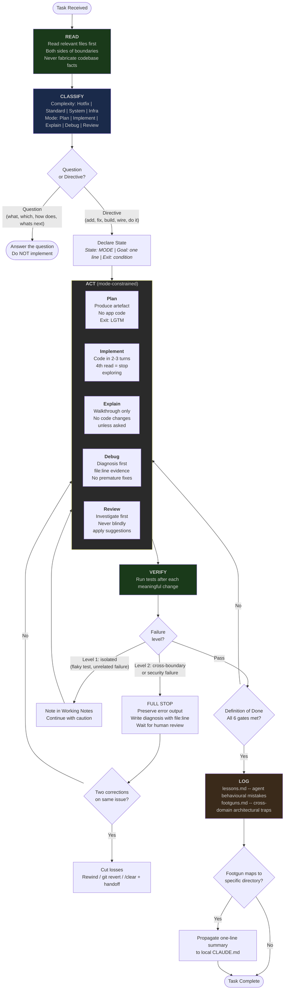

# AI Workflow Design Rationale

**Companion to:** `system-spec.md`
**Purpose:** Per-section "problem it solves" context and source attributions for every design decision in the system specification.

---

## Sources Referenced

| Short Name          | Full Reference                                                                                   |
| ------------------- | ------------------------------------------------------------------------------------------------ |
| HumanLayer          | HumanLayer's CLAUDE.md research -- instruction budgets, auto-generated context performance impact |
| Philipp Schmid      | Philipp Schmid -- frontier model instruction following limits (~150-200 effective instructions)   |
| GitHub 2,500-repo   | GitHub's 2,500-repo agents.md analysis -- tool mention effect (160x usage uplift)                 |
| awslabs/aidlc       | awslabs/aidlc-workflows -- structured agent lifecycle patterns                                    |
| Oruç                | Omer Faruk Oruç's claude.md -- execution loop and mode classification patterns                    |
| Trail of Bits       | Trail of Bits claude-code-config -- deny-dangerous patterns, security hardening                   |
| Boris Tane          | Boris Tane's Claude Code workflow -- session management, handoff protocols                        |
| Microsoft AutoDev   | Microsoft AutoDev paper -- autonomous agent guardrails and verification loops                     |
| Propel              | Propel's codebase structuring guide -- context loading strategies                                 |
| BlunderGOAT SBAO    | BlunderGOAT -- SBAO planning methodology                                                          |
| BlunderGOAT Scanner | BlunderGOAT -- SEO Scanner case study (PHP library implementation)                                |
| BlunderGOAT CC      | BlunderGOAT -- Claude Code Insights article                                                       |
| BlunderGOAT PBYP    | BlunderGOAT -- Plan Before You Prompt article                                                     |

---

## High-Level: System Architecture

---

## Execution Loop Flowchart

---

## 5-Layer Architecture

**Problem:** Loading all instructions every session wastes context budget and degrades compliance.

**Key evidence:**
- Auto-generated context files reduce success rates by ~3% while increasing inference cost by 20%+ (HumanLayer)
- Frontier models follow ~150-200 instructions reliably; Claude Code's system prompt consumes ~50, leaving ~100-150 for CLAUDE.md (Philipp Schmid, HumanLayer)
- Tools mentioned in AGENTS.md are used 160x more often than unmentioned ones (GitHub 2,500-repo)

**Design decision:** Only Layer 1 (CLAUDE.md, ~120 lines) loads every session. Everything else loads on demand via the router table, slash commands, or automatic directory-level loading.

**Why 5 layers, not 3 or 7:** Each layer has a distinct loading trigger -- always (L1), automatic per-directory (L2), on-demand by user (L3/L4), or CI/regression (L5). Fewer layers would combine different loading semantics. More would create layers with no meaningful distinction.

**Progressive disclosure (attention zone design):** Research shows the beginning and end of the context window receive higher attention than the middle. The 5-layer loading model exploits this: CLAUDE.md loads at session start (high-attention zone), Skills load at invocation time (also high-attention, because they're the most recent content). The middle of the conversation -- where context degrades -- is where on-demand loading avoids placing instructions. This architecture recovers ~15,000 tokens per session compared to front-loading everything.

---

## Guidelines Ownership Split

**Problem:** Projects with both CLAUDE.md and a shared guidelines file end up with overlapping rules -- two different Definitions of Done, two different testing strategies. The agent follows whichever it reads last, creating inconsistent behaviour.

**Incident:** On a Tauri app, CLAUDE.md had a DoD ("tests green, preflight passes, logs updated") and the guidelines file had a different DoD ("tests pass, rollback strategy exists, verification story"). The agent alternated between them unpredictably.

**Design decision:** Clean ownership boundary. CLAUDE.md owns workflow. Guidelines owns engineering practices. Test: if a rule would be identical across every project, it belongs in guidelines.

**Evidence it works:** Applying the split to a PHP library shrunk the guidelines file from 47 to 39 lines (17% reduction) -- the DoD section ("Before Marking Done") was the overlap. On a medical scribe app, the reduction was larger: 95 to 51 lines (46%) -- the guidelines had accumulated a full architecture section and a 7-point cross-layer checklist that belonged in CLAUDE.md.

---

## Project Shape (Removed in v0.4.0)

**Original rationale:** Different project shapes (app/library/collection) were expected to need different rubric checks. In practice, real implementations showed all projects need the same checks - the same execution loop, autonomy tiers, skills, and enforcement regardless of shape. Permission profiles were the only shape-gated checks, and they were reclassified as create-on-first-use (N/A for everyone). See ADR-002.

---

## Skill Justification Test

**Problem:** Skill proliferation. Early versions had 8+ skills. Each skill consumes instruction budget when loaded and creates maintenance burden.

**Design decision:** A skill must have at least one of: a distinct artefact, a hard workflow gate, a special failure mode, or a repeatable structured output.

| Former Skill        | Why it failed                                          | Where it went                       |
| ------------------- | ------------------------------------------------------ | ----------------------------------- |
| `/annotation-cycle` | No distinct artefact -- it's a planning refinement step | Section in mob elaboration playbook |
| `/sbao-synthesis`   | Template, not a workflow with gates                    | Section in SBAO planning playbook   |
| `/review-triage`    | Normal review behaviour, not a distinct mode           | Review branch of the ACT step       |
| `/revert-rescope`   | Tactic (2 sentences), not a workflow                   | Paragraph in VERIFY/stop-the-line   |

**v1.5 refinement:** Implementation data confirms all seven original skills add value across all projects. **v2.9 expansion:** Three additional skills added (reflect, onboard, resume), bringing the total to ten skills per agent (security, debug, audit, investigate, review, plan, test, reflect, onboard, resume).

> **Superseded by ADR-007 (v0.8.0, finalized v0.9.3):** The reflect, onboard, and resume skills were consolidated into existing skill modes. goat-audit merged into goat-review (Audit Mode). goat-context removed. goat-investigate merged into goat-debug (Investigate Mode). goat-simplify merged into goat-review (Simplify Mode). goat-refactor merged into goat-plan (Refactor Planning Mode). The canonical skill count is now **6 skills** per agent (5 specialized + goat dispatcher). See `ai-docs/decisions/ADR-007-consolidate-skills-10-to-8.md`.

---

## Instruction Budget Constraint

**Problem:** More instructions doesn't mean better compliance. Degradation is uniform, not sequential -- the model doesn't just ignore rules at the bottom; it gets worse at following all of them equally.

**Sources:** HumanLayer (auto-generated context data), Philipp Schmid (instruction following limits), GitHub 2,500-repo analysis (tool mention uplift)

**Design decision:** Hard line target (120, never over 150). The original 100/120 split was dropped after real implementations showed all projects need the same budget. Cut priority list for when you go over. "Never cut" list for the three things that matter most: execution loop, autonomy tiers, definition of done.

**Why 120:** The PHP library's first pass produced 127 lines. Compression got it to 99 but adding SCOPE and budgets brought it back to ~110. The Tauri app stabilised at 121. The shell script collection grew to 101. Every implementation with the 6-step loop, budgets, and all required sections lands in the 100-120 range.

---

## Execution Loop (Pointer)

The execution loop is the core behavior contract and is fully specified in `docs/system-spec.md`:
`READ → CLASSIFY → SCOPE → ACT → VERIFY → LOG`.

This section intentionally points to the canonical spec to avoid drift. Keep all
operational detail there and in root instruction files; this rationale page
stores only why that loop exists and what changed when tuning it.

In short:
- **Problem prevention:** prevents fabrication, scope drift, rushed acting, and repeated release of known mistakes without learning.
- **Why this form:** explicit step boundaries make failures observable and
  gateable (especially `VERIFY` and `LOG`), which reduced mode-switching bugs
  in early iterations.

---

## Dual-Agent Coordination

**Problem:** When both Claude Code and Codex share `ai-docs/footguns/` and `ai-docs/lessons/`, changes by one agent affect the other. On a shell script collection, Codex retitled 5 entries and removed 3 that Claude Code's implementation had created.

**Design decision:** Document the coordination risk. Simplest rule: run Claude Code first (it creates the shared docs), then Codex (it merges with existing). Review Codex's changes to shared files before committing.

---

## Hook Saga Conclusion

**Problem the anti-rationalisation hook tried to solve:** The agent declaring victory without completing work -- calling issues "pre-existing," deferring to follow-ups nobody asked for, listing problems without fixing them.

**Why it failed:** Prompt-type Stop hooks only see the assistant's response. They cannot read the conversation. Intent detection is always inferred, never observed. Six versions in one day, each failing in a different way. The false positive rate (~30%) eroded trust faster than the success rate (~70%) built it.

| Version | Approach                              | What went wrong                                                |
| ------- | ------------------------------------- | -------------------------------------------------------------- |
| v0.1    | Single paragraph, no intent check     | False positives on every question                              |
| v0.2    | Hook infrastructure                   | Exit codes, infinite loop guard -- no prompt iteration          |
| v0.3    | User-intent keyword matching          | Haiku can't see the user message                               |
| v0.4    | Response-pattern detection            | Haiku returned prose instead of JSON                           |
| v0.5    | Two-step flow with JSON-only preamble | Claude's own "Want me to fix?" offer triggered false match     |
| v0.6    | Pasted content detection              | Best version, but JSON schema fragile across reimplementations |

**Design decision:** Removed entirely. Deterministic command hooks for mechanical enforcement. CLAUDE.md rules for behavioural guidance. Prompt hooks for semantic judgement are structurally unsound with current hook architecture.

**Unexplored alternative:** "Flag, don't block" -- instead of the hook deciding to reject, it surfaces suspicious patterns to the human as highlights. The hook flags, the human decides. This avoids the ~30% false positive rate that killed autonomous semantic hooks while preserving awareness. Consistent with the Ask First trust model. Not yet implemented.

---

## Autonomy Tiers

**Problem:** All-or-nothing permission models. Either the agent can do everything (dangerous) or must ask for everything (slow).

**Source:** Trail of Bits claude-code-config (deny patterns), awslabs/aidlc (structured agent lifecycle with approval gates)

**Design decision:** Three tiers -- Always, Ask First, Never. The micro-checklist for Ask First items forces the agent to prove it has read the related code, checked for footguns, and knows the rollback command before proceeding. Asking "can I change the auth middleware?" without context forces the human to investigate. The checklist front-loads the investigation to the agent.

---

## Definition of Done

**Problem:** "Done" means different things in different contexts. Without explicit gates, the agent says "task complete" after tests pass -- even if old patterns remain after a rename, logs weren't updated, or a boundary was crossed without approval.

**Source:** Repeated incidents where "tests green" was treated as done. Gate #6 (grep after rename) came from a specific incident where three files still referenced an old function name. (BlunderGOAT CC)

---

## Phase 1 Hooks

### deny-dangerous.sh (pre-tool: Claude Code PreToolUse / Gemini CLI BeforeTool)

**Problem:** Instruction file "never" rules work ~70% of the time. A pre-tool hook that blocks `rm -rf` before it executes works 100%.

**Source:** Trail of Bits claude-code-config

### stop-lint.sh (post-turn: Claude Code Stop / Gemini CLI AfterAgent)

**Why exit 0 on errors:** Post-turn hooks run after every agent turn. A non-zero exit tells the agent "something failed, fix it." The agent tries to fix it. The hook runs again. If the fix doesn't clear the error, the agent loops forever. Exit 0 with errors to stderr makes the feedback informational, not imperative.

### format-file.sh (post-tool: Claude Code PostToolUse / Gemini CLI AfterTool)

**Skip when no formatter:** Projects without a configured formatter have no use for the post-tool hook. Creating one that re-runs the linter duplicates the post-turn hook. Only create when a real formatter exists (prettier, php-cs-fixer, rustfmt, gofmt, shfmt).

---

## Adoption Tiers

**Problem:** The full system is too much for a new project or a solo developer.

**Source:** The Tauri app built up the system over weeks. The PHP library implemented it in 2 sessions. The shell script collection implemented it in 1 session. Different starting points, different tier needs.

**Design decision:** Three tiers with clear "when to use" guidance. Each tier is self-contained -- you don't need to plan for the next tier while implementing the current one.

---

## Phase 2: Agent Evals

**Problem:** CLAUDE.md changes can silently regress agent behaviour. Adding a new rule, removing an old one, or tweaking wording can cause previously-correct behaviour to break. Without regression testing, these regressions are discovered in production work.

**Incident:** On the Tauri app, a rule change that improved one workflow broke another. (BlunderGOAT CC)

**Design decision:** Flat .md files in `ai-docs/evals/`, each containing a replay prompt from a real incident. When CLAUDE.md or skills change, replay the prompts and verify the agent still handles them correctly. Why flat files, not folders: each eval is a single .md file with no supporting assets - the folder structure added navigation friction with no benefit.

---

## Phase 2: RFC 2119 Pass

**Problem:** All rules treated as equally important. The agent can't distinguish "you MUST run tests" from "you MAY skip the formatter during debugging." Without priority markers, the model allocates equal attention to everything - and when budget is tight, drops important rules as readily as optional ones.

**Design decision:** MUST for the execution loop, autonomy tiers, and definition of done. SHOULD for log hygiene, working memory, session handoffs, footgun propagation. MAY for structural debt trigger, communication when blocked. Applied in the same pass as prose compression - two birds, one edit.

---

## Phase 2: Permission Profiles

**Problem:** Different team roles need different permission scopes. A frontend developer shouldn't be editing backend files. Without profiles, the agent has full access regardless of the task.

**Design decision:** Each profile restricts Edit and Bash permissions to relevant file patterns. Always allows Read everywhere - restricting reads prevents the agent from understanding context.

---

## Quarterly Shrink Principle

**Problem:** The system accumulates rules that outlive their usefulness. A footgun that was critical six months ago may have been fixed in code. A lesson that was important when the agent was less capable may now be default behaviour.

**Design decision:** Periodic re-count, stale rule check, and the question: "if I removed this, would the model still do the right thing?" Rules that once helped become constraints as models improve. The system is designed to get smaller over time, not larger.

**Model-version gating (v0.7 addition):** The original principle assumed models would improve monotonically. They don't -- new model releases can regress on specific behaviours. Updated process:

1. Run the agent eval suite on the new model version
2. If all evals pass, identify rule removal candidates (rules never triggered in 90+ days, rules now enforced mechanically by tooling)
3. Remove candidates
4. Re-run evals to confirm no regressions
5. Maintain a rollback plan for the next model version

Shrink based on **tooling improvements** (better linters, better hooks, better CI) and **rules never triggered** -- not assumptions about base model capability.

---

## Hot Path / Cold Path Architecture

**Problem:** Instruction files must stay under 120 lines, but projects have domain-specific conventions (frontend patterns, backend rules, security constraints) that agents need when working in those areas.

**Source:** 6 real implementations showed every project needs ~200-500 lines of domain guidance that doesn't fit in the hot path. Projects with `.github/instructions/` files had the right idea but were too file-scoped (one file per language instead of one per domain).

**Design decision:** Split into hot path (agent behavior, 120 lines) and cold path (project coding guidelines, unlimited). Cold path lives at `ai-docs/coding-standards/` with a router at `ai-docs/README.md`. Domain-based organization (backend.md, frontend.md) not language-based (php.md, python.md). `.github/instructions/` serves as Copilot bridge files. `.github/git-commit-instructions.md` is universal for any git project.
