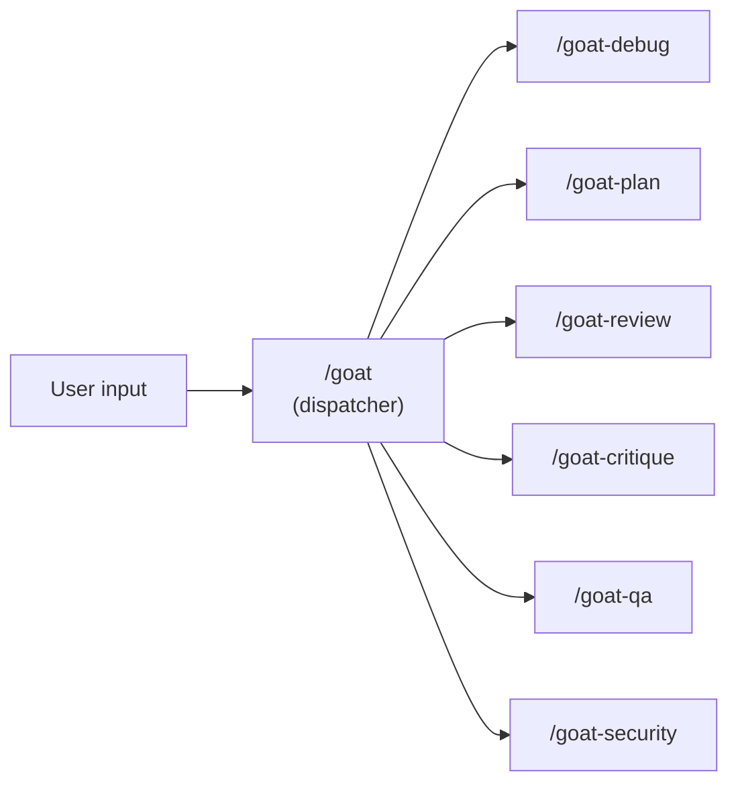
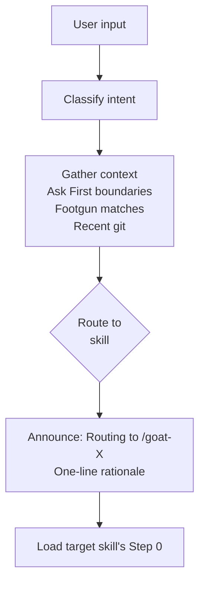
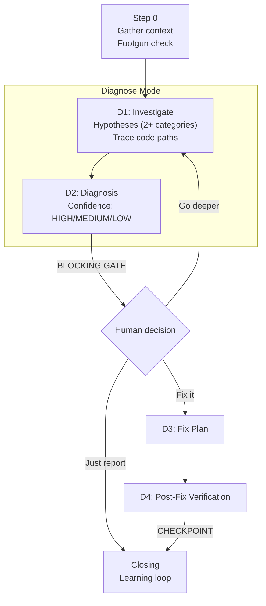
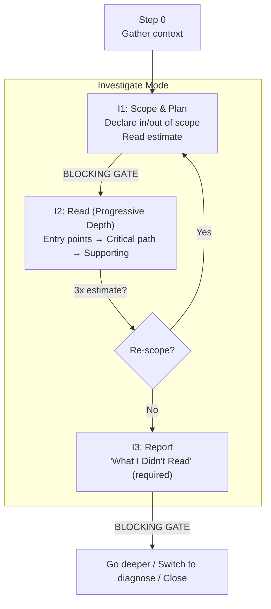
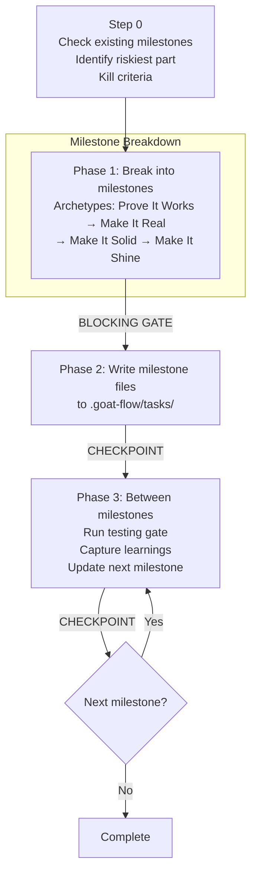
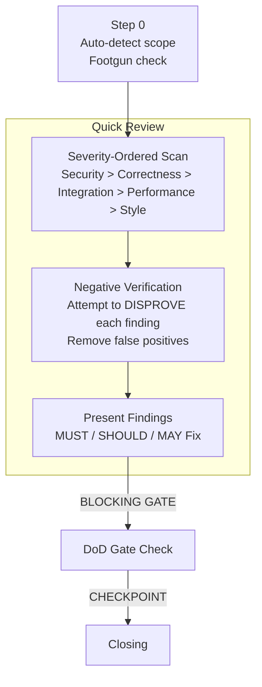
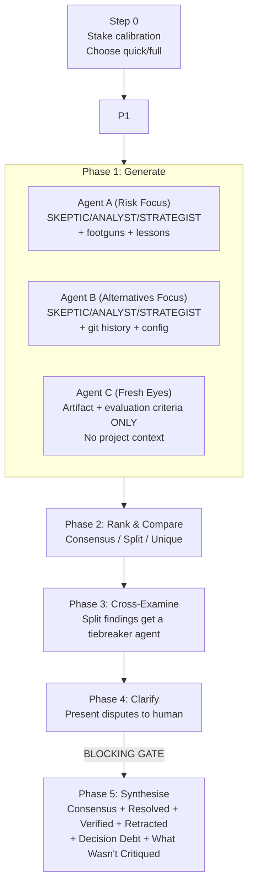
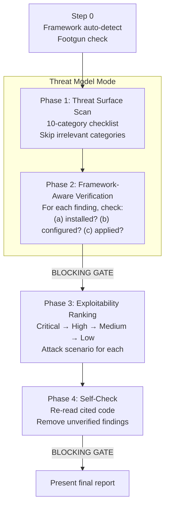
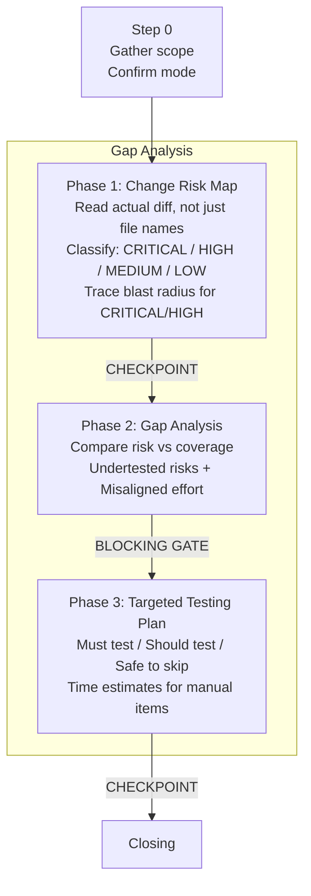

# Skills

Seven focused capabilities (six plus dispatcher) loaded on demand. Each skill has a distinct artifact, a hard quality gate, and a repeatable output. Skills don't load unless invoked - they stay out of the instruction budget.

All skills use the `goat-` prefix to avoid conflicts with built-in agent commands.

| Skill | Purpose | Hard Gate | When to Use |
|-------|---------|-----------|-------------|
| [/goat](#goat--dispatcher) | Route to the right skill | -- | Always (convenience layer) |
| [/goat-debug](#goat-debug) | Diagnosis-first debugging + investigate mode | No fixes until human reviews diagnosis | Bug or test failure, exploring unfamiliar code |
| [/goat-plan](#goat-plan) | Milestone planning with testing gates | Human approval between milestones | Before non-trivial implementation |
| [/goat-review](#goat-review) | Structured code review + quality audit | MUST read all files before commenting | Before merging, quality audits |
| [/goat-critique](#goat-critique) | Multi-perspective critique of any artifact | Disputes resolved before synthesis | High-stakes decisions, plans, assessments |
| [/goat-security](#goat-security) | Threat-model-driven security assessment | MUST rank findings by exploitability | Before releases, after dependency changes, during audits |
| [/goat-qa](#goat-qa) | Testing gap analysis and verification planning | Does not run or write tests; generates gap analysis and testing plan | After a milestone or 30-60 min of coding |

---

## Choosing the Right Skill

| Situation | Skill | Why not the others |
|-----------|-------|--------------------|
| "Are there security issues?" | /goat-security | Threat-model-driven scan with framework verification |
| "This test is failing, why?" | /goat-debug | Need diagnosis before fixing |
| "How healthy is this module?" | /goat-review (audit mode) | Systematic scan, not a single bug |
| "How does this subsystem work?" | /goat-debug (investigate mode) | Understanding before changing |
| "I'm new to this project" | /goat-debug (investigate mode) | Progressive depth reading + orientation |
| "How should we build this feature?" | /goat-plan | Planning before implementing |
| "Are these changes safe to merge?" | /goat-review | Reviewing changes, not finding new issues |
| "How do we verify this work?" | /goat-qa | Risk-based testing gap analysis |
| "Is this plan/assessment sound?" | /goat-critique | Multi-perspective critique before shipping |

---

## /goat - Dispatcher

Route to the right skill in one step. Type `/goat` followed by what you need.

The dispatcher classifies intent conversationally - not by keyword lookup. It asks 0-2 clarification questions max and routes with a stated assumption if still ambiguous.

| Intent | Skill |
|--------|-------|
| Bug, error, symptom, crash | /goat-debug (diagnose) |
| Explore, understand, new to this | /goat-debug (investigate) |
| Review changes, PR, diff | /goat-review (quick review) |
| Quality sweep, audit | /goat-review (audit) |
| Security, vulnerability, compliance | /goat-security |
| Plan, design, build a feature | /goat-plan (via Planning Route) |
| Test gaps, coverage, verify | /goat-qa |
| Critique a plan/assessment | /goat-critique |

**Planning Route:** For planning requests, the dispatcher checks `.goat-flow/tasks/` for existing plans first, then routes based on complexity: Hotfix → direct execution; Small Feature → compressed brief → `/goat-plan`; Standard → feature brief → `/goat-plan`; System/Infrastructure → feature brief → `/goat-plan` → suggest `/goat-critique`.

---

## /goat-debug

Diagnosis-first debugging and codebase investigation.

| Mode | Trigger | What it does |
|------|---------|-------------|
| **Diagnose** | bug, error, crash, symptom | Hypothesis-driven debugging with confidence-gated fixes |
| **Investigate** | explore, understand, how does, new to this | Deep codebase reading with progressive depth and evidence tags |

**Diagnose mode:**

No fixes until human reviews diagnosis. Confidence levels: HIGH = reproduced, MEDIUM = traced but not reproduced, LOW = inferred from code reading.

**Investigate mode:**

For onboarding ("I'm new to this project"), use investigate mode - covers stack detection and codebase orientation through progressive depth reading.

---

## /goat-plan

Milestone task file generator and manager. Creates structured milestone files in `.goat-flow/tasks/` that track progress, enforce testing gates, and provide local working state for the current session.

**Milestone archetypes:** Prove It Works (spike the riskiest part first) → Make It Real (end-to-end working) → Make It Solid (edge cases, security) → Make It Shine (polish, optional). Each milestone has kill criteria, assumption tracking, and a testing gate before the next begins. For Hotfix/Small Feature scope, milestones can be delivered inline rather than written to files.

**Key constraints:** MUST check for existing milestone files before creating new ones. MUST include testing gates on every milestone. MUST NOT continue building on an invalidated assumption.

---

## /goat-review

Structured code review and quality audit with negative verification.

| Mode | Trigger | What it does |
|------|---------|-------------|
| **Quick Review** | review, PR, diff | Severity-ordered scan of changes with negative verification |
| **Audit** | audit, quality sweep | Systematic codebase area scan - findings only, no fixes |

**Quick Review:**

MUST NOT flag pre-existing issues as part of this change. MUST attempt to disprove each finding before presenting it.

**Audit mode:** For codebase areas (not a diff). Scan using severity ordering, run negative verification, group 3+ related findings as systemic patterns. MUST NOT propose fixes in audit mode - findings only.

---

## /goat-critique

Multi-perspective critique using sub-agent orchestration. Takes any concrete artifact (plan, security assessment, debug hypothesis set, review findings, architecture proposal) and generates competing analyses from multiple perspectives.

| Mode | When | Agents | Phases |
|------|------|--------|--------|
| **Quick** (default) | Standard complexity, 1-10 files affected | 2 (Alternatives + Fresh Eyes) | 3: Generate → Rank → Synthesise |
| **Full** | System/Infrastructure complexity, security-critical, 10+ files | 3 (Risk + Alternatives + Fresh Eyes) | 5: Generate → Rank → Cross-Examine → Clarify → Synthesise |

Quick mode skips Phases 3 and 4 - goes directly from Rank to Synthesise.

**Key constraints:** MUST use Agent tool calls for sub-agents, not inline role-play. MUST restrict Agent C to artifact + evaluation criteria only (no project context). MUST include "What Wasn't Critiqued" section (never empty). MUST tag low-confidence recommendations as Decision Debt.

---

## /goat-security

Threat-model-driven security assessment with framework-aware verification.

| Mode | Trigger | What it does |
|------|---------|-------------|
| **Threat model** | security, vulnerability, OWASP | Full threat surface scan with exploitability ranking |
| **Dependency audit** | dependencies, CVEs, supply chain | Focused dependency vulnerability scan |
| **Compliance** | HIPAA, GDPR, compliance | Regulation-specific controls assessment |

**Threat model mode:**

MUST check framework built-in mitigations before flagging. A finding mitigated by the framework's defaults is a false positive, not a finding. Confidence classification: CONFIRMED (entry-to-sink traced), PROBABLE (plausible, missing source trace), THEORETICAL (policy gap, no exploit path).

| Framework | Check these mitigations first |
|-----------|------------------------------|
| Laravel | CSRF middleware, mass assignment protection, Eloquent parameterization |
| Django | CSRF middleware, ORM parameterization, `SECRET_KEY` rotation |
| Express | Helmet headers, rate limiting, CORS configuration |
| Spring | Spring Security filters, CSRF protection, parameter binding |
| Go | `html/template` auto-escaping, `crypto/rand`, HTTP client timeouts |

---

## /goat-qa

Testing gap analyser. Compares code changes against testing coverage to find undertested risks and misaligned test effort. Does not write test code - hands off to the coding agent.

| Mode | Trigger | What it does |
|------|---------|-------------|
| **Standard** | test, verify, gaps | Risk-based gap analysis for recent changes |
| **Audit** | test audit, coverage | Audit existing test coverage for a codebase area |
| **Regression Guard** | after bug fix | Define invariants and assess coverage for a specific fix |

---

## Shared Conventions

Every skill shares:
- **Step 0** - context gathering before any work begins
- **BLOCKING GATEs** - agent stops and waits for human decision
- **CHECKPOINTs** - agent reports status and continues unless interrupted
- **Footgun check** - cross-reference `.goat-flow/footguns/` for known traps
- **Learning loop** - log lessons and footguns after completion
- **Ceremony scaling** - hotfixes skip ceremony, system changes get full treatment

See `.goat-flow/skill-reference/skill-preamble.md` (installed) or `workflow/skills/reference/skill-preamble.md` (source template) for the canonical shared conventions.

## Where Skills Live

| Agent | Path |
|-------|------|
| Claude Code | `.claude/skills/goat-{name}/SKILL.md` |
| Codex | `.agents/skills/goat-{name}/SKILL.md` |
| Gemini CLI | `.agents/skills/goat-{name}/SKILL.md` |

Skills are created during step 03 of the GOAT Flow setup. The skill templates in `workflow/skills/` document the prompts used to create them.

> **Consolidation history (v0.8.0-v1.1.0):** Nine skills were consolidated into the current seven. See ADR-030 for the full rationale. goat-critique was extracted as a standalone critique skill in v1.1.0, then renamed from goat-sbao in v1.2.0 (ADR-033).
