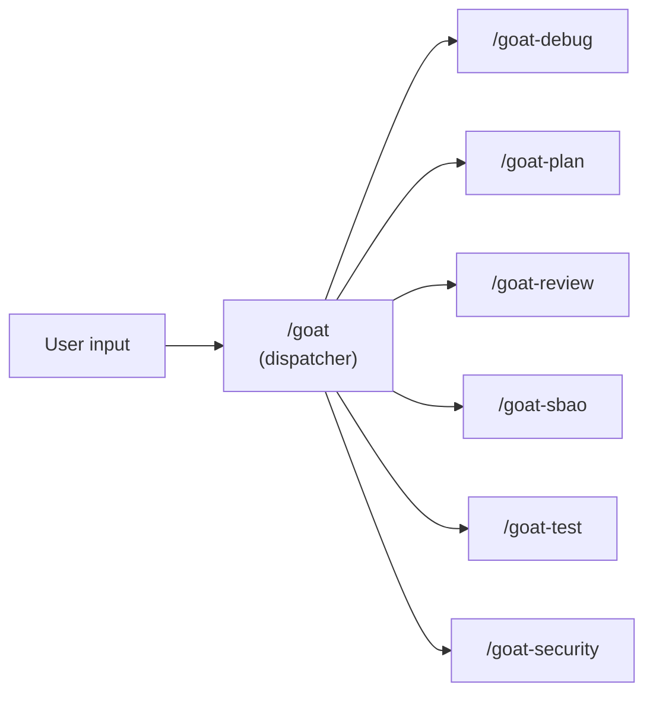

# Skills

Seven focused capabilities (six plus dispatcher) loaded on demand. Each skill has a distinct artifact, a hard quality gate, and a repeatable output. Skills don't load unless invoked - they stay out of the instruction budget.

All skills use the `goat-` prefix to avoid conflicts with built-in agent commands.

## Overview

| Skill | Purpose | Hard Gate | When to Use |
|-------|---------|-----------|-------------|
| [/goat](goat-dispatcher.md) | Route to the right skill | -- | Always (convenience layer) |
| [/goat-debug](goat-debug.md) | Diagnosis-first debugging + investigate mode | No fixes until human reviews diagnosis | Bug or test failure, exploring unfamiliar code |
| [/goat-plan](goat-plan.md) | Milestone planning with testing gates | Human approval between milestones | Before non-trivial implementation |
| [/goat-review](goat-review.md) | Structured code review + quality audit | MUST read all files before commenting | Before merging, quality audits |
| [/goat-sbao](goat-sbao.md) | Multi-perspective critique of any artifact | Disputes resolved before synthesis | High-stakes decisions, plans, assessments |
| [/goat-security](goat-security.md) | Threat-model-driven security assessment | MUST rank findings by exploitability | Before releases, after dependency changes, during audits |
| [/goat-test](goat-test.md) | Testing gap analysis and verification planning | Agent may run fast local checks; deeper verification generated as plan | After a milestone or 30-60 min of coding |

> **Consolidation history (v0.8.0-v1.1.0):** Nine skills were consolidated into the current seven. Former standalone skills were absorbed into existing skills or removed. See ADR-030 for the full rationale. goat-sbao was later extracted as a standalone critique skill in v1.1.0 (ADR-033).

---

## Choosing the Right Skill

| Situation | Skill | Why not the others |
|-----------|-------|--------------------|
| "Are there security issues?" | /goat-security | Threat-model-driven scan with framework verification |
| "This test is failing, why?" | /goat-debug | Need diagnosis before fixing |
| "How healthy is this module?" | /goat-review (audit mode) | Systematic scan, not a single bug |
| "How does this subsystem work?" | /goat-debug (investigate mode) | Understanding before changing |
| "I'm new to this project" | /goat-debug (investigate mode) | Progressive depth reading + orientation |
| "How should we build this feature?" | /goat-plan | Planning before implementing |
| "Are these changes safe to merge?" | /goat-review | Reviewing changes, not finding new issues |
| "How do we verify this work?" | /goat-test | Risk-based testing gap analysis |
| "Is this plan/assessment sound?" | /goat-sbao | Multi-perspective critique before shipping |

---

## Shared Conventions

Every skill shares:
- **Step 0** -- context gathering before any work begins
- **BLOCKING GATEs** -- agent stops and waits for human decision
- **CHECKPOINTs** -- agent reports status and continues unless interrupted
- **Footgun check** -- cross-reference `.goat-flow/footguns/` for known traps
- **Learning loop** -- log lessons and footguns after completion
- **Ceremony scaling** -- hotfixes skip ceremony, system changes get full treatment

See `workflow/skills/reference/skill-preamble.md` for the canonical shared conventions.

---

## Where Skills Live

| Agent | Path |
|-------|------|
| Claude Code | `.claude/skills/goat-{name}/SKILL.md` |
| Codex | `.agents/skills/goat-{name}/SKILL.md` |
| Gemini CLI | `.agents/skills/goat-{name}/SKILL.md` |
| Copilot CLI | `.github/skills/goat-{name}/SKILL.md` |

Skills are created during step 03 of the GOAT Flow setup. The skill templates in `workflow/skills/` document the prompts used to create them.

---

## Why Each Skill Is Designed This Way

### /goat-security
**Problem:** Security gaps ship undetected. Dependencies have known CVEs, secrets leak into code, permission boundaries are misconfigured.
**Design:** Threat-model-driven scan with framework-aware verification. Attempt to DISPROVE each finding against the framework's built-in mitigations before reporting. Rank by exploitability with attack scenarios.

### /goat-debug
**Problem:** Agents guess fixes before understanding the bug. "Just try something" works ~30% of the time and creates confusing diffs the other 70%.
**Design:** Hard gate — hypotheses across 2+ categories, diagnosis with file:line evidence and confidence level (HIGH = reproduced, MEDIUM = traced, LOW = inferred), fixes only after human reviews. Investigate mode: progressive depth reading with OBSERVED/INFERRED evidence tagging.

### /goat-review
**Problem:** Rubber-stamp reviews and fabricated audit findings. Agent says "looks good" or invents plausible-sounding issues.
**Design:** Two modes. Quick review: severity-ordered scan with negative verification (attempt to DISPROVE each finding). Audit mode: systematic codebase scan with negative verification + fabrication self-check. Both modes use footgun matching and full-file context.

### /goat-plan
**Problem:** Jumping into implementation without structured planning. Features get built without clear scope, success criteria, or phased milestones.
**Design:** Milestone task file generator. Feature brief (via dispatcher) → milestones with archetypes (Prove It Works → Make It Real → Make It Solid → Make It Shine), exit/kill criteria, assumption tracking, and testing gates between milestones. Adapts depth to complexity tier. Inline mode for small work.

### /goat-test
**Problem:** Testing effort doesn't match code risk. Critical changes go untested while low-risk changes get over-tested.
**Design:** Testing gap analyser — compares code changes against testing coverage, classifies risk per change, and produces prioritized "must test / should test / safe to skip" guidance. Does not write test code — hands off to the coding agent.

## Skill Justification Test

A skill earns its place if it meets ALL of:

1. **Distinct artifact** - produces something the execution loop doesn't
2. **Hard quality gate** - has pass/fail criteria, not subjective
3. **Special failure mode** - addresses a failure the loop alone misses
4. **Repeatable output** - same input produces consistent results

Skills that failed this test and were downgraded to inline instructions: `/annotation-cycle`, `/sbao-synthesis`, `/review-triage`, `/revert-rescope`.

See ADR-030 for the full consolidation history (9 skills → 7).
