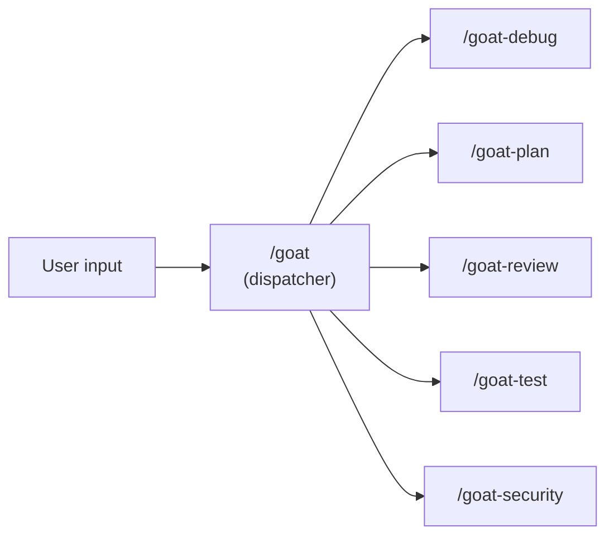

# Skills

Five focused capabilities (plus dispatcher) loaded on demand. Each skill has a distinct artifact, a hard quality gate, and a repeatable output. Skills don't load unless invoked - they stay out of the instruction budget.

All skills use the `goat-` prefix to avoid conflicts with built-in agent commands.

## Overview

| Skill | Purpose | Hard Gate | When to Use |
|-------|---------|-----------|-------------|
| [/goat](goat-dispatcher.md) | Route to the right skill | -- | Always (convenience layer) |
| [/goat-security](goat-security.md) | Threat-model-driven security assessment | MUST rank findings by exploitability; framework-aware verification | Before releases, after dependency changes, during audits |
| [/goat-debug](goat-debug.md) | Diagnosis-first debugging + investigate/onboard mode | No fixes until human reviews diagnosis; investigate: no planning until human reviews | Bug or test failure, exploring unfamiliar code, onboarding |
| [/goat-review](goat-review.md) | Structured code review + quality audit + simplify mode | MUST read all files before commenting; simplify: MUST NOT change behavior | Before merging, quality audits, instruction staleness, readability improvement |
| [/goat-plan](goat-plan.md) | 4-phase planning workflow + refactor planning mode | Human approval between each phase; refactor: grep-after-every-rename | Before non-trivial implementation, cross-file renames/restructuring |
| [/goat-test](goat-test.md) | 3-phase test plan generation | Coding agent MUST NOT verify its own work (doer-verifier) | After a milestone or 30-60 min of coding |

> **Consolidation (v0.8.0, finalized v0.9.3):** /goat-reflect merged into /goat-review (Instruction Review Mode). /goat-onboard merged into /goat-debug (Onboard Mode). /goat-audit merged into /goat-review (Audit Mode). /goat-context removed. /goat-investigate merged into /goat-debug (Investigate Mode). /goat-simplify merged into /goat-review (Simplify Mode). /goat-refactor merged into /goat-plan (Refactor Planning Mode). /goat dispatcher added in v0.9.0.

---

## Choosing the Right Skill

| Situation | Skill | Why not the others |
|-----------|-------|--------------------|
| "Are there security issues?" | /goat-security | Threat-model-driven scan with framework verification |
| "This test is failing, why?" | /goat-debug | Need diagnosis before fixing |
| "How healthy is this module?" | /goat-review (audit mode) | Systematic scan, not a single bug |
| "How does this subsystem work?" | /goat-debug (investigate mode) | Understanding before changing |
| "I'm new to this project" | /goat-debug (onboard mode) | Stack detection + orientation |
| "How should we build this feature?" | /goat-plan | Planning before implementing |
| "Are these changes safe to merge?" | /goat-review | Reviewing changes, not finding new issues |
| "Are our instruction files stale?" | /goat-review (instruction mode) | Friction signals + staleness audit |
| "How do we verify this work?" | /goat-test | Generate test plan across 3 phases |
| "I need to rename across files" | /goat-plan (refactor mode) | Both-sides-first + grep-after-rename |
| "This code is hard to follow" | /goat-review (simplify mode) | Readability without behavior change |

---

## Shared Conventions

Every skill shares:
- **Step 0** -- context gathering before any work begins
- **BLOCKING GATEs** -- agent stops and waits for human decision
- **CHECKPOINTs** -- agent reports status and continues unless interrupted
- **Footgun check** -- cross-reference `.goat-flow/footguns/` for known traps
- **Learning loop** -- log lessons and footguns after completion
- **Ceremony scaling** -- hotfixes skip ceremony, system changes get full treatment

See `workflow/skills/reference/skill-preamble.md` for the canonical shared conventions.

---

## Where Skills Live

| Agent | Path |
|-------|------|
| Claude Code | `.claude/skills/goat-{name}/SKILL.md` |
| Codex | `.agents/skills/goat-{name}/SKILL.md` |
| Gemini CLI | `.agents/skills/goat-{name}/SKILL.md` |
| Copilot CLI | `.github/skills/goat-{name}/SKILL.md` |

Skills are created during Phase 1b of the GOAT Flow setup. The skill templates in `workflow/skills/` document the prompts used to create them.

---

## Why Each Skill Is Designed This Way

### /goat-security
**Problem:** Security gaps ship undetected. Dependencies have known CVEs, secrets leak into code, permission boundaries are misconfigured.
**Design:** Threat-model-driven scan with framework-aware verification. Attempt to DISPROVE each finding against the framework's built-in mitigations before reporting. Rank by exploitability with attack scenarios.

### /goat-debug
**Problem:** Agents guess fixes before understanding the bug. "Just try something" works ~30% of the time and creates confusing diffs the other 70%. Also: planning without understanding the codebase leads to wrong assumptions.
**Design:** Hard gate - hypotheses across 2+ categories, diagnosis with file:line evidence and confidence level, fixes only after human reviews. Investigate mode: progressive depth reading with OBSERVED/INFERRED evidence tagging. Onboard mode: stack detection + instruction drafting for new projects.

### /goat-review
**Problem:** Rubber-stamp reviews and fabricated audit findings. Agent says "looks good" or invents plausible-sounding issues. Also: code readability degrades without structured improvement.
**Design:** Four modes in one skill. Standard review: RFC 2119 severity, footgun matching, full-file context. Audit mode: negative verification + fabrication self-check. Instruction review mode: friction signals + staleness audit. Simplify mode: readability-focused analysis with semantics-preserving constraint, prefer renaming over commenting.

### /goat-plan
**Problem:** Jumping into implementation without structured planning. Features get built without clear scope, success criteria, or phased milestones. Also: cross-file changes break when one side is updated without reading the other.
**Design:** 4-phase workflow with human gates. Feature brief -> Mob elaboration -> Triangular tension (SKEPTIC/ANALYST/STRATEGIST) -> Milestones with exit/kill criteria. Adapts depth to complexity tier. Refactor planning mode: both-sides-first reading, grep-after-every-rename, doc cross-reference check.

### /goat-test
**Problem:** The coding agent verifies its own work and declares victory. Self-assessment is unreliable - the agent has blind spots for the same failure modes it introduced.
**Design:** Generates test plans across three phases. The coding agent produces the plan but does NOT execute verification - separate agents and the human do (doer-verifier principle).

## Skill Justification Test

A skill earns its place if it meets ALL of:

1. **Distinct artifact** - produces something the execution loop doesn't
2. **Hard quality gate** - has pass/fail criteria, not subjective
3. **Special failure mode** - addresses a failure the loop alone misses
4. **Repeatable output** - same input produces consistent results

Skills that failed this test and were downgraded to inline instructions: `/annotation-cycle`, `/sbao-synthesis`, `/review-triage`, `/revert-rescope`.

Skills that were consolidated (v0.8.0-v0.9.3): `/goat-reflect` -> `/goat-review` (Instruction Review Mode). `/goat-onboard` -> `/goat-debug` (Onboard Mode). `/goat-audit` -> `/goat-review` (Audit Mode). `/goat-context` removed. `/goat-investigate` -> `/goat-debug` (Investigate Mode). `/goat-simplify` -> `/goat-review` (Simplify Mode). `/goat-refactor` -> `/goat-plan` (Refactor Planning Mode).
