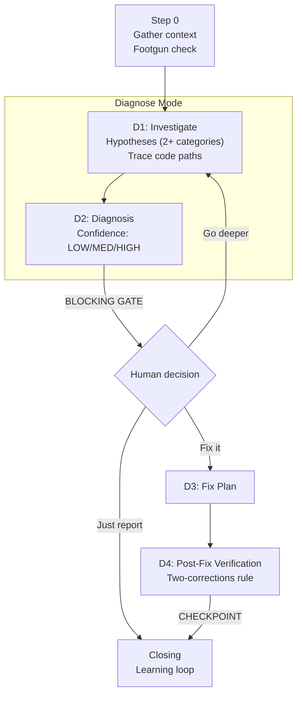
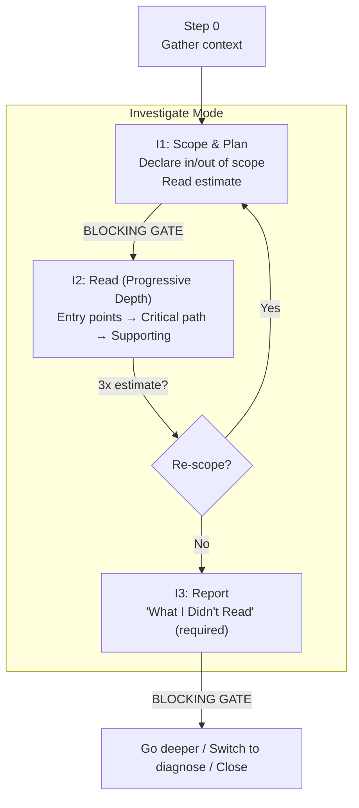

# /goat-debug

Diagnosis-first debugging, codebase investigation, and project onboarding.

## Modes

| Mode | Trigger | What it does |
|------|---------|-------------|
| **Diagnose** | bug, error, crash, symptom | Hypothesis-driven debugging with confidence-gated fixes |
| **Investigate** | explore, understand, how does | Deep codebase reading with progressive depth and evidence tags |
| **Onboard** | new to this, onboard | Stack detection + guided codebase orientation |

## Diagnose Mode

**Key constraint:** No fixes until human reviews diagnosis. If confidence is LOW, the agent cannot propose a fix — must investigate further.

## Investigate Mode

## Onboard Mode

Runs Investigate mode (I1-I3) with two additional phases:

- **O1 (before I1):** Stack detection — languages, frameworks, build/test/lint commands
- **O2 (after I3):** Glossary and instruction drafting — build `ai-docs/glossary.md` from codebase

**Source:** `workflow/skills/goat-debug.md`
