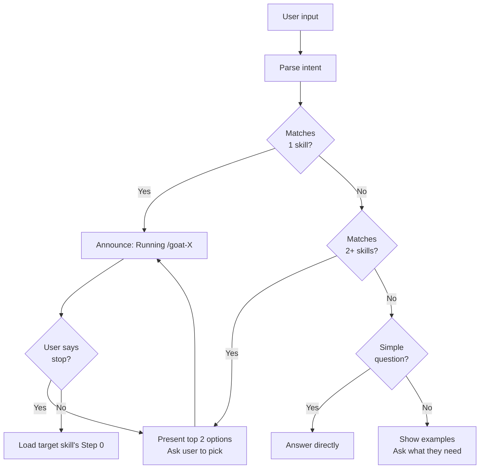

# /goat -- Dispatcher

Route to the right skill in one step. Type `/goat` followed by what you need.

## Flow

## Intent Routing

| Keywords | Skill | Mode |
|----------|-------|------|
| bug, error, broken, crash | /goat-debug | Diagnose |
| understand, explore, onboard | /goat-debug | Investigate |
| review, PR, diff, code review | /goat-review | Standard |
| audit, quality sweep | /goat-review | Audit |
| simplify, clean up, naming | /goat-review | Simplify |
| security, vulnerability, CVE, CVEs, OWASP | /goat-security | Threat model |
| HIPAA, GDPR, compliance | /goat-security | Compliance |
| dependencies, outdated packages, supply chain | /goat-security | Dependency audit |
| plan, design, architect | /goat-plan | Plan |
| rename, refactor, restructure | /goat-plan | Refactor |
| test, coverage, test plan | /goat-test | -- |

## After Completion

The dispatcher suggests the most likely next skill based on what just finished (e.g., debug -> test to verify the fix).

**Source:** `workflow/skills/goat.md`
