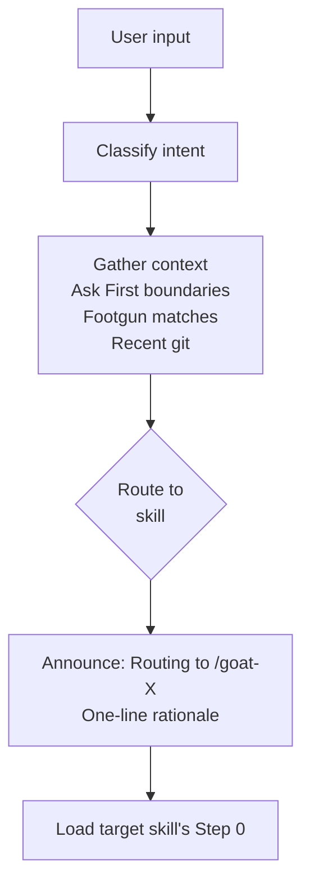

# /goat -- Dispatcher

Route to the right skill in one step. Type `/goat` followed by what you need.

## Flow

## Routing

The dispatcher classifies intent conversationally — not by keyword lookup. It asks 0-2 clarification questions max and routes with a stated assumption if still ambiguous.

| Intent | Skill |
|--------|-------|
| Bug, error, symptom, crash | /goat-debug (diagnose) |
| Explore, understand, new to this | /goat-debug (investigate) |
| Review changes, PR, diff | /goat-review (quick review) |
| Quality sweep, audit | /goat-review (audit) |
| Security, vulnerability, compliance | /goat-security |
| Plan, design, build a feature | /goat-plan (via Planning Route) |
| Test gaps, coverage, verify | /goat-test |
| Critique a plan/assessment | /goat-sbao |

## Planning Route

For planning requests, the dispatcher checks `.goat-flow/tasks/` for existing plans first, then routes based on complexity:

| Complexity | Approach |
|------------|----------|
| Hotfix | Route to direct execution, no planning |
| Small Feature | Compressed brief → `/goat-plan` |
| Standard | Feature brief → mob (optional) → `/goat-plan` |
| System / Infrastructure | Feature brief → mob (recommended) → `/goat-plan` → suggest `/goat-sbao` |

**Source:** `workflow/skills/goat.md`
