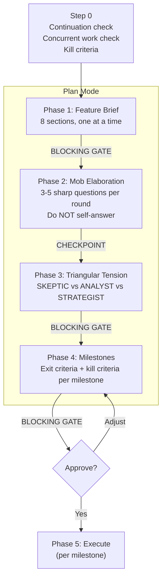
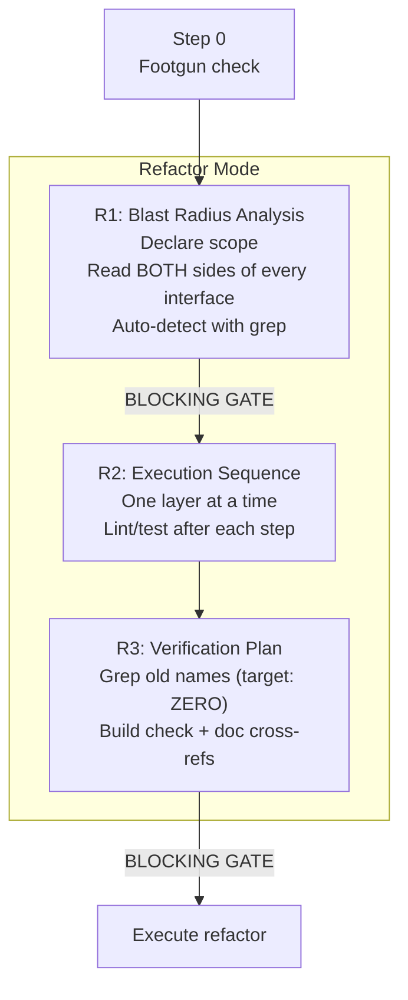

# /goat-plan

Structured planning for features and cross-file refactoring.

## Modes

| Mode | Trigger | What it does |
|------|---------|-------------|
| **Plan** | plan, design, architect, build | 4-phase feature planning with human gates |
| **Refactor** | rename, move, extract, restructure | Blast radius analysis with grep-after-every-rename |

## Plan Mode

**Key constraint:** Human approval between phases. Hotfixes skip Phases 2-3 and get a compressed 3-5 line brief.

## Refactor Planning Mode

**Key constraint:** MUST read both sides of every interface before changing. MUST grep after every rename. MUST check docs, not just source.

**Source:** `workflow/skills/goat-plan.md`
