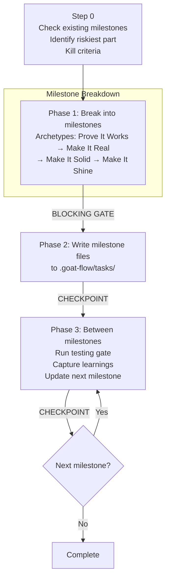

# /goat-plan

Milestone task file generator and manager. Creates structured milestone files in `.goat-flow/tasks/` that track progress, enforce testing gates, and provide shared state between human and coding agent.

## Flow

**Key features:**
- **Milestone archetypes:** Prove It Works (spike the riskiest thing first) → Make It Real (end-to-end working) → Make It Solid (edge cases, security) → Make It Shine (polish, optional)
- **Kill criteria:** What would make you stop at this milestone
- **Assumption tracking:** Checkboxes with evidence when validated or invalidated
- **Testing gates:** Between every milestone — automated + manual + acceptance
- **Inline mode:** For Hotfix/Small Feature scope, milestones can be delivered inline rather than written to files

**Key constraint:** MUST check for existing milestone files before creating new ones. MUST include testing gates on every milestone. MUST NOT continue building on an invalidated assumption.

**Source:** `workflow/skills/goat-plan.md`
