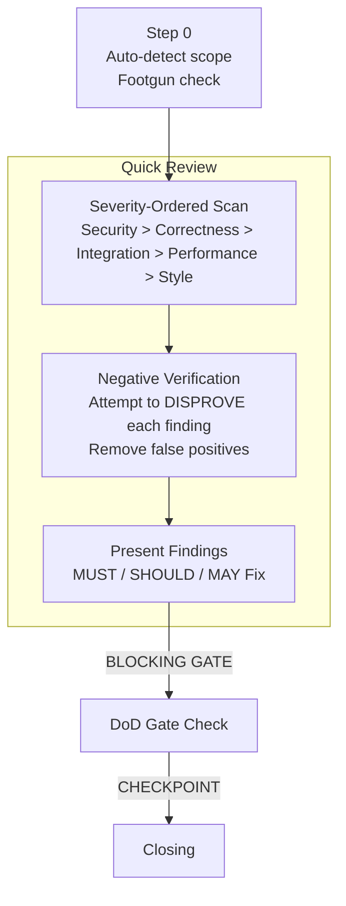

# /goat-review

Structured code review and quality audit with negative verification.

## Modes

| Mode | Trigger | What it does |
|------|---------|-------------|
| **Quick Review** | review, PR, diff | Severity-ordered scan of changes with negative verification |
| **Audit** | audit, quality sweep | Systematic codebase area scan — findings only, no fixes |

## Quick Review

**Key constraint:** MUST NOT flag pre-existing issues as part of this change. MUST attempt to disprove each finding before presenting it.

## Audit Mode

For codebase areas (not a diff). Scan using severity ordering, run negative verification, group 3+ related findings as systemic patterns.

**Key constraint:** MUST NOT propose fixes in audit mode — findings only.

**Source:** `workflow/skills/goat-review.md`
