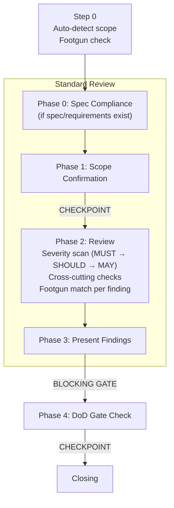
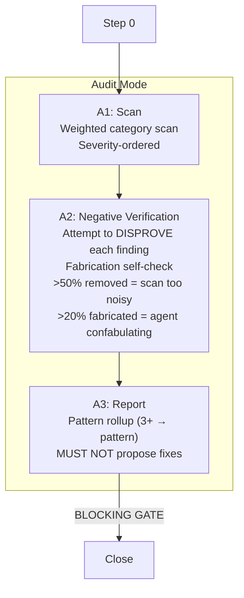
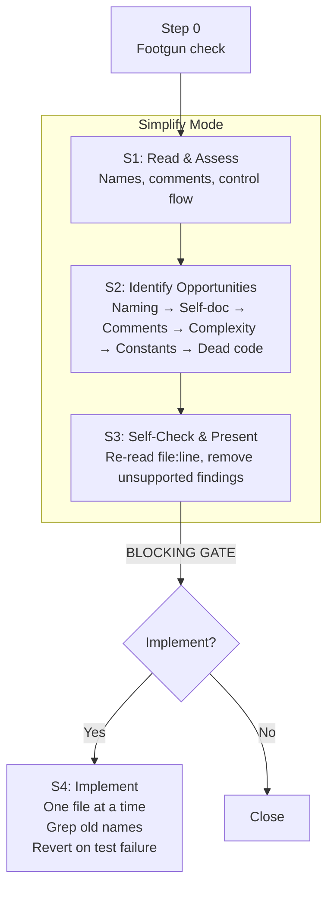

# /goat-review

Structured code review, quality audit, instruction review, and readability improvement.

## Modes

| Mode | Trigger | What it does |
|------|---------|-------------|
| **Standard** | review, PR, diff | RFC 2119 severity review of changes |
| **Audit** | audit, quality sweep | Systematic codebase quality scan with negative verification |
| **Instruction** | instruction staleness | Audit CLAUDE.md/AGENTS.md for drift and missing rules |
| **Simplify** | simplify, clean up, naming | Readability improvement without behavior change |

## Standard Review

## Audit Mode

**Key constraint:** In audit mode, MUST attempt to disprove each finding. MUST NOT propose fixes — findings only.

## Simplify Mode

**Key constraint:** MUST NOT change behavior. If a rename crosses file boundaries or changes a public API, redirect to /goat-plan refactor mode.

**Source:** `workflow/skills/goat-review.md`
