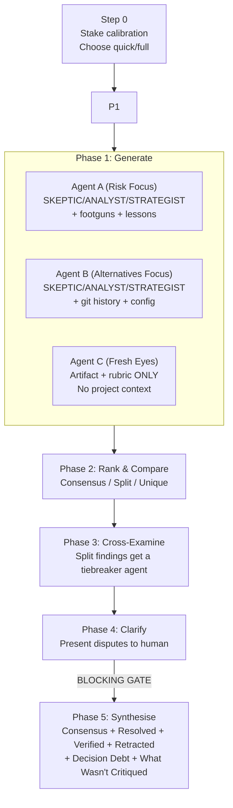

# /goat-sbao

Multi-perspective critique using sub-agent orchestration. Takes any concrete artifact (plan, security assessment, debug hypothesis set, review findings, architecture proposal) and generates competing analyses from multiple perspectives.

## Modes

| Mode | When | Agents | Phases |
|------|------|--------|--------|
| **Quick** (default) | Standard complexity, 1-10 files affected | 2 (Alternatives + Fresh Eyes) | 3: Generate → Rank → Synthesise |
| **Full** | System/Infrastructure complexity, security-critical, 10+ files | 3 (Risk + Alternatives + Fresh Eyes) | 5: Generate → Rank → Cross-Examine → Clarify → Synthesise |

## Flow (Full Mode)

Quick mode skips Phases 3 and 4 — goes directly from Rank to Synthesise.

**Key constraints:**
- MUST use Agent tool calls for sub-agents, not inline role-play
- MUST restrict Agent C to artifact + rubric only (no project context)
- MUST include "What Wasn't Critiqued" section (never empty)
- MUST tag low-confidence recommendations as Decision Debt

**Source:** `workflow/skills/goat-sbao.md`
