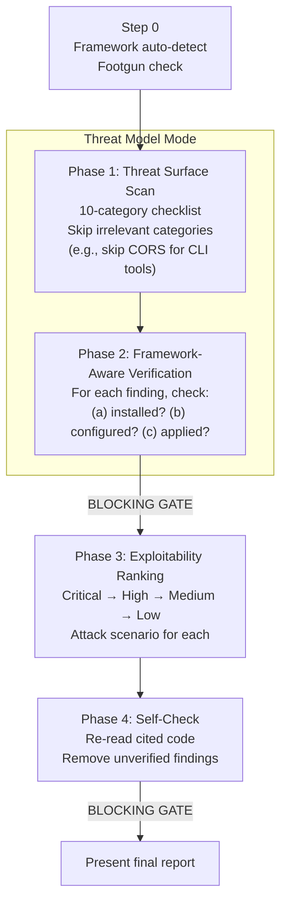
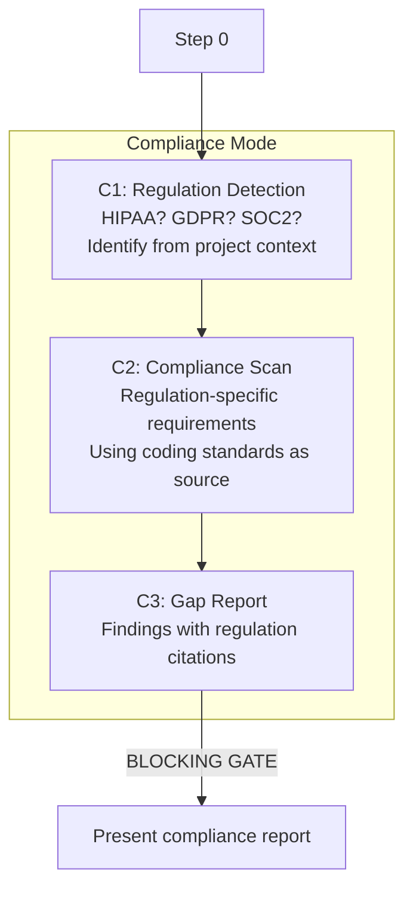

# /goat-security

Threat-model-driven security assessment with framework-aware verification.

## Modes

| Mode | Trigger | What it does |
|------|---------|-------------|
| **Threat model** | security, vulnerability, OWASP | Full threat surface scan with exploitability ranking |
| **Dependency audit** | dependencies, CVEs, supply chain | Focused dependency vulnerability scan |
| **Compliance** | HIPAA, GDPR, compliance | Regulation-specific controls assessment |

## Threat Model Mode

**Key constraint:** MUST check framework built-in mitigations before flagging. A finding mitigated by the framework's defaults is a false positive, not a finding.

## Compliance Mode

## Framework Verification Table

| Framework | Check these mitigations first |
|-----------|------------------------------|
| Laravel | CSRF middleware, mass assignment protection, Eloquent parameterization |
| Django | CSRF middleware, ORM parameterization, `SECRET_KEY` rotation |
| Express | Helmet headers, rate limiting, CORS configuration |
| Spring | Spring Security filters, CSRF protection, parameter binding |
| Go | `html/template` auto-escaping, `crypto/rand`, HTTP client timeouts |

**Source:** `workflow/skills/goat-security.md`
