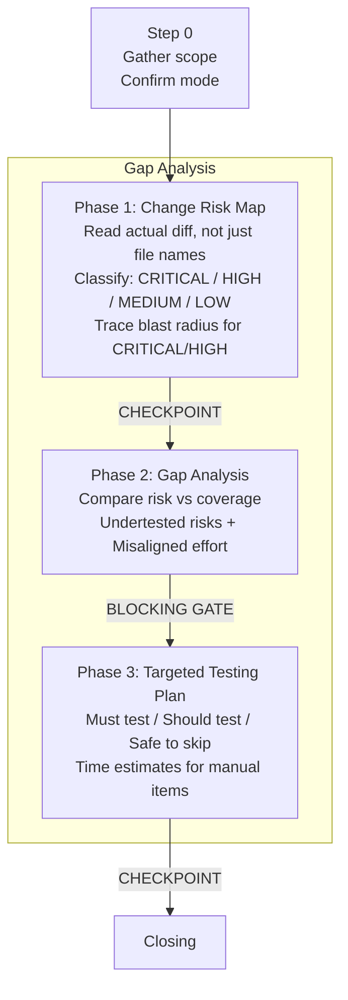

# /goat-test

Testing gap analyser. Compares code changes against testing coverage to find undertested risks and misaligned test effort.

## Modes

| Mode | Trigger | What it does |
|------|---------|-------------|
| **Standard** | test, verify, gaps | Risk-based gap analysis for recent changes |
| **Audit** | test audit, coverage | Audit existing test coverage for a codebase area |
| **Regression Guard** | after bug fix | Define invariants and assess coverage for a specific fix |

## Flow

**Key constraint:** goat-test is a gap ANALYSER — it finds mismatches between code changes and testing coverage. It does not write test code. It hands off testing tasks to the coding agent.

**Source:** `workflow/skills/goat-test.md`
