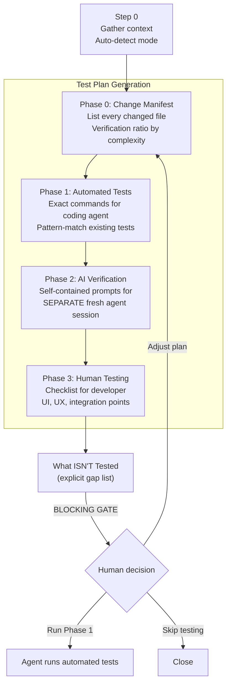
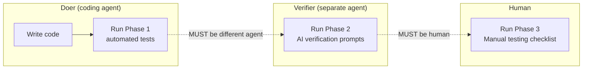

# /goat-test

Three-phase test plan generation using the doer-verifier principle.

## Modes

| Mode | Trigger | What it does |
|------|---------|-------------|
| **Standard** | test, coverage | Full 3-phase test plan for recent changes |
| **Quick** | small change, hotfix | Abbreviated plan for 1-2 file changes |
| **Audit** | test audit, coverage gaps | Audit existing test coverage without new changes |

## Flow

## The Doer-Verifier Principle

**Key constraint:** The coding agent MUST NOT verify its own work. Phase 2 prompts must be completely self-contained — the verifier agent starts fresh with no context from the coding session.

**Source:** `workflow/skills/goat-test.md`
