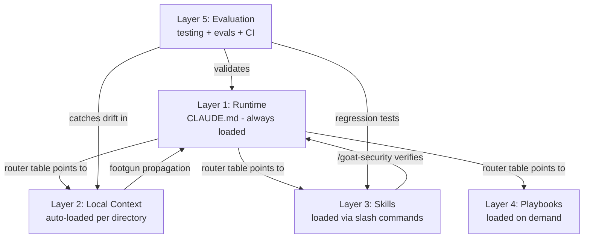

# The 5-Layer System

AI coding agents need structure, not just rules. This system organises everything an agent needs into five layers, each loading at a different time and serving a different purpose. Only Layer 1 loads every session. Everything else loads on demand.

```
┌─────────────────────────────────────────────────────────────┐
│  Layer 1 - Runtime                              ALWAYS ON   │
│  CLAUDE.md / AGENTS.md (~120 lines)                         │
│  Execution loop, autonomy tiers, DoD, router table          │
├─────────────────────────────────────────────────────────────┤
│  Layer 2 - Local Context                        AUTO-LOAD   │
│  Directory-level instruction files                          │
│  High-risk boundaries, module-specific gotchas              │
├─────────────────────────────────────────────────────────────┤
│  Layer 3 - Skills                               ON DEMAND   │
│  /goat-security, /goat-debug, /goat-review,                  │
│  /goat-plan, /goat-test                                      │
├─────────────────────────────────────────────────────────────┤
│  Layer 4 - Playbooks                            ON DEMAND   │
│  Feature briefs, mob elaboration, SBAO ranking,             │
│  milestone planning                                         │
├─────────────────────────────────────────────────────────────┤
│  Layer 5 - Evaluation                           ON DEMAND   │
│  Agent eval suite, CI context validation,                   │
│  doer-verifier testing workflow                             │
└─────────────────────────────────────────────────────────────┘
```

---

## Layer 1 - Runtime

**What:** The root instruction file (`CLAUDE.md` for Claude Code, `AGENTS.md` for Codex). This is the agent's operating system - it loads every session, so every line must earn its place.

**Line budget:** ~120 lines. Beyond 150 triggers an anti-pattern deduction. Evidence: auto-generated context beyond this range reduces agent success rates by ~3% and increases cost by 20%+ (HumanLayer, Philipp Schmid instruction limits research).

**What it contains:**

| Section | Purpose |
|---------|---------|
| **Execution loop** | READ → CLASSIFY → SCOPE → ACT → VERIFY → LOG. The 6-step behaviour loop that prevents fabrication, scope creep, mode drift, early victory declarations, and silent failures. |
| **Autonomy tiers** | Always (safe, reversible) / Ask First (project-specific boundaries) / Never (destructive, irreversible). Each tier maps to an enforcement layer. |
| **Definition of Done** | 6 explicit gates. A task is not done until all gates pass. Includes the grep-after-rename gate and log-update gate. |
| **Router table** | Points to everything below - skills, local context files, docs, architecture. This is the highest-leverage section (tools mentioned here get 160x more usage - GitHub 2,500-repo analysis). |
| **Stack definition** | Build, test, lint, format commands. The agent's cheat sheet for the project's toolchain. |
| **Working memory** | Escalation ladder for long tasks: scratchpad → handoff file → ask human. |

**Enforcement:** Three layers protect the Runtime rules:
1. **Permissions deny list** (`settings.json` in `.claude/` or `.gemini/`) - hardest enforcement, blocks commands before they run
2. **Hooks** (`.claude/hooks/` or `.gemini/hooks/`) - pre-tool deny-dangerous, post-turn lint, post-tool format
3. **Instruction file rules** - behavioural guidance the agent follows (softest layer, ~70% compliance)

**This folder:** `workflow/runtime/`

---

## Layer 2 - Local Context

**What:** Directory-level instruction files that auto-load when the agent works in that directory. A file at `src/auth/CLAUDE.md` loads every time the agent touches auth code.

**When to create:** When a module has 2+ footgun entries, is an Ask First boundary, or has conventions that differ from the project default. Do NOT create one for every directory.

**What it contains:** Module-specific footguns (1-2 lines each), local convention differences, cross-boundary warnings, hard constraints. Max ~20 lines per file.

**Relationship to footguns.md:** `docs/footguns.md` is the central index and source of truth. Footguns mapped to a specific directory are **propagated** (not moved) as one-line summaries into local instruction files.

**File locations:**

| Agent | Path |
|-------|------|
| Claude Code | `*/CLAUDE.md` (auto-loaded by directory) |
| Codex | `.github/instructions/*.md` (with `applyTo` frontmatter) |

**This folder:** `workflow/coding-standards/`

---

## Layer 3 - Skills

**What:** Focused capabilities loaded via slash commands. Each skill has a distinct artifact, a hard quality gate, and a repeatable output. Skills don't load unless invoked - they stay out of the instruction budget.

**The five skills (+ dispatcher):**

| Skill | Purpose | Output |
|-------|---------|--------|
| `/goat-security` | Threat-model-driven security assessment | Findings ranked by exploitability |
| `/goat-debug` | Root cause analysis + investigate/onboard mode | Diagnosis with evidence trail |
| `/goat-review` | Structured review + quality audit + instruction review + simplify modes | Findings ranked by severity |
| `/goat-plan` | Feature planning with phased human gates + refactor planning mode | Plan with milestones |
| `/goat-test` | Generate test plans across three verification phases | Test instructions (automated, AI, human) |

**Skill justification test:** A skill earns its place if it has at least one of: a distinct artifact, a hard workflow gate, a special failure mode, or a repeatable structured output. Skills that failed this test were downgraded to inline instructions.

**Naming:** All skills use the `goat-` prefix to avoid conflicts with built-in agent commands.

**File locations:**

| Agent | Path |
|-------|------|
| Claude Code | `.claude/skills/goat-{name}/SKILL.md` |
| Gemini CLI | `.agents/skills/goat-{name}/SKILL.md` |
| Codex | `.agents/skills/goat-{name}/SKILL.md` |
| Copilot CLI | `.github/skills/goat-{name}/SKILL.md` |

**This folder:** `workflow/skills/`

---

## Layer 4 - Playbooks

**What:** Planning tools loaded on demand when the developer needs to plan, scope, or break down work. These are not agent-runtime files - they're methodology templates the developer uses to structure thinking before giving the agent a task.

**Note:** Layer 4 is human-invoked methodology, not agent-loaded context. Unlike Layers 1-3 (which the agent reads and follows) and Layer 5 (which validates the agent's work), Layer 4 structures how humans plan before giving the agent a task. It lives in the framework because it's used alongside agent work and references the same architecture.

**The planning sequence:**

| Step | Playbook | What it produces |
|------|----------|-----------------|
| 1 | Feature Brief | Product definition: what, why, who, scope, risks, open questions |
| 2 | Mob Elaboration | Clarifying questions from multiple perspectives, with recommendations |
| 3 | SBAO Ranking | 3 competing plans ranked against criteria, synthesised into a prime plan |
| 4 | Milestone Planning | Phased implementation plan with tasks, exit criteria, assumptions, risks |

**When to use:** Before any non-trivial implementation. Run the sequence in order. Each step feeds the next.

**This folder:** `workflow/playbooks/`

---

## Layer 5 - Evaluation

**What:** Quality infrastructure that verifies the agent's work and catches drift over time. Includes the doer-verifier testing workflow, agent eval regression suites, CI context validation, and the learning loop (footguns, lessons).

**Components:**

| Component | Purpose | When it runs |
|-----------|---------|-------------|
| **Doer-verifier testing** | Three parallel verification tracks (automated tests, AI verification, human testing) after every milestone or 30-60 minutes of coding | After every coding session |
| **Agent evals** | Regression tests from real incidents - replay prompts that verify the agent handles known failure modes correctly | On demand, or after CLAUDE.md changes |
| **CI context validation** | Automated checks: instruction file line count, router reference resolution, skill completeness | On every PR |
| **Learning loop** | `docs/footguns.md` (cross-domain coupling with file:line evidence), `docs/lessons.md` (what worked/failed) | Updated after every task |

**Cold path (ai/instructions/):** Project-specific coding guidelines organized by domain. Loaded on demand when the task matches -- frontend.md for frontend work, backend.md for backend work, etc. Router at `ai/README.md` tells agents what to load. Keeps the hot path under 120 lines by moving domain details to dedicated files.

**Create on first use:** Two artifacts materialise when first needed, not pre-created empty: agent profiles directory (e.g., `.claude/profiles/` or `.gemini/profiles/`, create when meaningful role separation exists), and `docs/decisions/` (create when there's a real architectural decision worth recording). All other artifacts are created during initial setup.

**The doer-verifier principle:** The coding agent is the doer. Testing uses independent verifiers - automated suites, separate AI agents, and the developer. Never trust the coding agent's self-assessment.

**This folder:** `workflow/evaluation/`

---

## How the Layers Connect



Layer 1 is the hub. Its router table is the index to everything else. Layers 2-4 extend the agent's capabilities without bloating the always-loaded instruction budget. Layer 5 sits outside the agent's runtime and verifies the whole system is working correctly.

---

## Implementation Phases

| Phase | What it builds | Layers |
|-------|---------------|--------|
| Phase 0 (bootstrap) | Minimal instruction file + deny mechanism | Layer 1 (minimal) |
| Phase 1a | Full instruction file: execution loop, autonomy tiers, DoD, router, stack definition | Layer 1 |
| Phase 1b | Skills: /goat-security, /goat-debug, /goat-review, /goat-plan, /goat-test | Layer 3 |
| Phase 1c | Enforcement: hooks, permissions deny list, preflight script, context validation | Layer 1 enforcement |
| Phase 2 | Agent eval suite, CI validation, RFC 2119 pass | Layer 5, enhances Layers 1-4 |

**Quarterly shrink:** Model-version gating required before removing rules. Run the eval suite on the current model version first. Shrink based on tooling improvements and rules never triggered in 90+ days.

**Layer 2** (local context) and **Layer 4** (playbooks) are created as needed, not in a specific phase. Local context files appear when a directory accumulates enough footguns. Playbooks are used whenever planning is needed.

### Graduation: Experiment → Maintained Project

Phase 0 (bootstrap) is the experiment tier - minimal setup for prototypes and weekend projects. The full system is the maintained project tier.

**Graduation triggers** (any one of these means it's time for the full system):
- First production user
- First team contributor beyond the original developer
- First real incident or regression
- First month of active development
- Structural complexity threshold (multiple modules, cross-boundary dependencies)

Until graduation, Phase 0 is sufficient. Don't over-invest in a prototype.

---

## Project Type Reference (informational)

> **Note:** Project shape does not affect scoring or setup. All projects follow the same rules. This table is retained as a reference for Ask First boundary examples.

| Aspect | App | Library | Script Collection |
|--------|-----|---------|-------------------|
| Layer 1 line target | ~120 | ~120 | ~120 |
| Layer 2 local files | Likely needed | Create where needed | Create where needed |
| Layer 3 skills | All 9 | All 9 | All 9 |
| Layer 5 evals | Real incidents | Stack failure modes | Real incidents |

---

## Multi-Agent Support

GOAT Flow's core (execution loop, autonomy tiers, DoD, learning loop) is agent-agnostic. The enforcement and file structure differ per agent.

| Concept | Claude Code | Codex | Cursor | Copilot | Gemini CLI |
|---------|------------|-------|--------|---------|------------|
| Instruction file | CLAUDE.md | AGENTS.md | .cursor/rules/ | .github/copilot-instructions.md | GEMINI.md |
| Skills/playbooks | .claude/skills/ | .agents/skills/ | .cursor/rules/*.mdc | .github/skills/ | .agents/skills/ |
| Hooks/enforcement | .claude/hooks/ + settings.json | .codex/hooks/ + scripts/ (verification) | - | preToolUse, postToolUse lifecycle | .gemini/hooks/ + settings.json |
| Domain instructions | ai/instructions/ | ai/instructions/ | .cursor/rules/ | .github/instructions/ (bridges to ai/) | ai/instructions/ |
| Evals | agent-evals/ | agent-evals/ | agent-evals/ | agent-evals/ | agent-evals/ |
| Deny mechanism | permissions.deny array | .codex/rules/deny-dangerous.star (execpolicy) | - | - | permissions.deny array |

Setup guides: see `setup/setup-claude.md`, `setup/setup-gemini.md`, `setup/setup-codex.md`, and `setup/setup-copilot.md`.

---

## Sub-Agent Strategy

Three patterns for using sub-agents (supported by Claude Code Agent Teams, Codex parallel tasks, and similar):

### Fresh-context sub-agents (recommended default)

Each task gets a new agent instance with a clean context window. Prevents context rot mechanically. The orchestrator delegates tasks and collects results.

When to use: any task that can be scoped to a single focused objective. Most implementation tasks, code reviews, research tasks.

Pattern:
```
Orchestrator: "Implement the auth middleware. Scope: src/auth/. Exit: tests pass."
Sub-agent: gets clean context, reads only what it needs, returns result.
Orchestrator: integrates result, moves to next task.
```

### Parallel agent teams

Multiple agents work simultaneously, each in their own git worktree. Coordinated through shared state (GitHub Issues, task files, git).

When to use: independent tasks with no shared file dependencies. Multiple features in parallel, parallel code reviews, test writing alongside implementation.

Coordination rule: agents MUST NOT edit the same files. Use git worktrees for isolation.

### Role-based delegation

Specialised agents for specific roles (planning, implementation, review, testing). Each role has constrained permissions and focused context.

When to use: large projects with distinct SDLC phases. The /goat-plan skill handles the planning role. /goat-review handles the review role.

### Sub-agent rules

- One focused objective per sub-agent
- Structured return: paths changed, evidence found, confidence level, next step
- 5-call budget (soft limit - re-classify if exceeded)
- Sub-agents inherit the parent's autonomy tiers and Never list
- Sub-agents do NOT inherit working memory - they start clean

---

## Folder Structure

Documentation is split across `docs/` (specs, learning loop) and `workflow/` (templates, prompts):

```
docs/
├── system-spec.md            ← Canonical specification
├── getting-started.md        ← Entry point and reading order
├── system/
│   ├── five-layers.md        ← You are here
│   └── six-steps.md          ← 6-step execution loop
├── reference/                ← Design rationale, examples, competitive analysis
├── footguns.md               ← Cross-domain architectural traps
├── lessons.md                ← Agent behavioural mistakes
└── architecture.md           ← Project architecture overview

workflow/
├── runtime/                  ← Layer 1: setup prompts + project scaffolding
├── coding-standards/         ← Layer 2: domain instruction file prompts
├── skills/                   ← Layer 3: skill reference and justification
├── playbooks/                ← Layer 4: planning methodology prompts
└── evaluation/               ← Layer 5: testing workflow + evals
```
