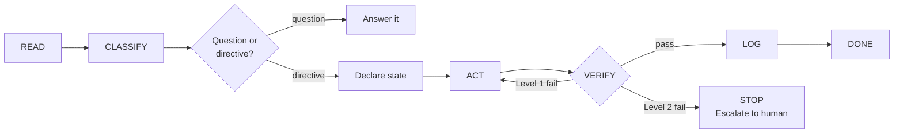

# The 6-Step Execution Loop

Every task the AI coding agent performs follows the same loop:

```
READ → CLASSIFY → SCOPE → ACT → VERIFY → LOG
```

This isn't a suggestion - it's the agent's operating procedure. Each step exists because a specific failure mode kept occurring without it. The loop lives in Layer 1 (the root instruction file) and loads every session.



---

## READ

**The problem it prevents:** Claude fabricates codebase facts. It guesses file contents, dependency versions, and API contracts without reading the actual files.

**The incident:** Asked about a dependency, Claude said it was a local path dependency. It was actually installed from a package registry. It never read the manifest.

**The rule:** Read the relevant files first. Never fabricate codebase facts. When starting work in a specific domain, also read the relevant cold-path file from `ai/instructions/` (see `ai/README.md` for the routing map).

| Project Shape | What to read |
|---------------|-------------|
| Apps | Both sides of cross-boundary changes (frontend + backend, API + consumer) |
| Libraries | Tests alongside implementation, data files alongside code |
| Script collections | Source chains - which shared files are sourced and how |

```
BAD:  "acme-client is a local path dependency" (fabricated without reading composer.json)
GOOD: Read composer.json first → "acme-client is installed via Packagist at ^1.3.0"
```

---

## CLASSIFY

**The problems it prevents:**
1. **Question/directive confusion** - "Did you also improve X?" gets treated as "improve X" when the user was just asking.
2. **Silent mode drift** - the agent slides from explaining into implementing without announcing the switch.

**The incident:** The question/directive confusion was exposed by the anti-rationalisation hook. A correct "No - want me to?" answer was rejected as "asking permission instead of implementing." The hook couldn't tell questions from directives either.

**The rule:** Classify the task on two axes before acting.

**Axis 1 - Complexity:**

| Level | Examples |
|-------|---------|
| Hotfix | One-line fix, typo, config tweak |
| Standard Feature | New endpoint, UI component, test suite |
| System Change | Architecture refactor, migration, new integration |
| Infrastructure Change | CI/CD, deployment, build system |

**Axis 2 - Mode:**

| Mode | What the agent does |
|------|-------------------|
| Plan | Produce an artifact (design doc, plan). No application code. |
| Implement | Write code. |
| Explain | Walkthrough only. No changes unless explicitly asked. |
| Debug | Diagnosis first. No fixes until human reviews. |
| Review | Independent investigation. Never blindly apply external suggestions. |

**Question vs directive:** If the message is a question, answer it. Do not infer an implementation action. If ambiguous: "Do you want me to explain this or fix it?"

**Mode transitions must be explicit.** No switching without announcing: "Switching to [NEW MODE] because [reason]."

**Anti-BDUF guard:** Don't over-engineer. Extract an interface when the second provider is needed, not before.

```
BAD:  User asked "explain the auth flow" → Claude edited auth_middleware.go
GOOD: User asked "explain the auth flow" → Claude wrote a clear walkthrough, no changes

BAD:  "Created INotificationProvider interface" (only one implementation exists)
GOOD: "EmailNotifier handles notifications. Extract interface when second provider needed."
```

---

## SCOPE

**The problem it prevents:** Agent touches files and systems outside the task's intended boundary. A "Standard Feature" task silently modifies auth code, deployment config, or unrelated modules.

**The rule:** After classifying, declare scope before acting.

```
Scope:
- Files: [list files/directories allowed to change]
- Systems: [list systems allowed to touch]
- Non-goals: [what this task explicitly does NOT do]
- Max blast radius: [escalate if changes spread beyond this boundary]
```

If changes need to extend beyond declared scope, stop and re-scope with the human before proceeding. Do not silently expand.

---

## ACT

**The problem it prevents:** Planning loops and premature fixes. In Plan mode, Claude reads file after file without producing an artifact. In Debug mode, Claude starts fixing before understanding the bug.

**The calibration:** The read budget (see below) was calibrated from repeated planning loops where Claude read 8-12 files and produced nothing.

**The rule:** Each mode has explicit behaviour constraints.

| Mode | Behaviour | Exit condition |
|------|-----------|---------------|
| Plan | Produce artifact. No application code. | "LGTM" or "implement" from human |
| Implement | Write code within 2-3 turns. Hit read budget without writing = stop exploring, start coding. | Task complete, tests pass |
| Explain | Walkthrough only. No code changes unless explicitly asked. | Explanation delivered |
| Debug | Diagnosis first with file:line evidence. No fixes until human reviews. | Human approves fix plan |
| Review | Investigate independently. Never blindly apply external suggestions. | Findings delivered |

**State declaration (required):**

```
State: [MODE] | Goal: [one line] | Exit: [condition]
```

No actions outside the declared state without announcing the switch and why.

**Read budget (scaled by complexity):**

| Complexity | Max reads before writing |
|-----------|------------------------|
| Hotfix | 2 |
| Standard Feature | 4 |
| System Change | 6 |
| Infrastructure | 8 |

If the read limit is hit, trigger re-classification before escalating.

**Turn budget (scaled by complexity):**

| Complexity | Max turns | Over-budget action |
|-----------|----------|-------------------|
| Hotfix | 3 | Re-classify or escalate |
| Standard Feature | 10 | Re-classify or escalate |
| System Change | 20 | Re-classify or escalate |
| Infrastructure | 25 | Re-classify or escalate |

Stop if: over turn budget AND no reduction in uncertainty over the last 2 turns. If over budget but making clear progress, re-classify before stopping.

### Re-Classification Protocol

If the agent hits the read limit or turn budget for its current complexity tier, it does NOT automatically escalate to the human. Instead:

1. Stop and declare `State: RE-CLASSIFY`
2. Explain why the scope has expanded based on evidence discovered
3. Upgrade the complexity tier and its associated budgets
4. Continue working under the new tier's limits

Only escalate to the human if:
- The task exceeds the highest tier (Infrastructure) budget
- The scope expansion crosses an Ask First boundary
- Two re-classifications have already occurred on the same task

### Auto-Triggering Skills (future)

Skills can be configured to trigger automatically based on context instead of manual invocation:

| Trigger | Skill | When |
|---------|-------|------|
| Pre-commit | /goat-security | Before any git commit attempt |
| Test failure | /goat-debug | When a test fails during VERIFY |
| PR creation | /goat-review | When creating or updating a pull request |
| New area | /goat-investigate | When working in a directory for the first time |

Implementation: map triggers to the agent's hook system (Claude Code: PostToolUse on git commit, Stop hook on test failure. Gemini CLI: AfterTool on git commit, AfterAgent on test failure. Codex: verification scripts. Cursor: rule triggers).

Auto-triggering eliminates the "forgot to run preflight" failure mode. The agent doesn't need to remember - the system enforces it.

---

## VERIFY

**The problem it prevents:** Claude declares victory early. Tests pass, but the old function name still appears in three files because nobody grepped after the rename.

**Absence verification principle:** After any replacement (rename, migration, deprecation, config change, dependency swap), verify the absence of the old pattern - not just the presence of the new one. Use workspace-wide `grep` or `rg` for this - the agent's localised file awareness is unreliable for confirming something is gone.

**Absence verification applies to:**
- **Renames:** grep for the old function/variable/class name
- **Migrations:** verify old table/column is no longer referenced in code
- **Deprecations:** verify old API endpoint is no longer called by any consumer
- **Config changes:** verify old config key/env var is no longer read anywhere
- **Dependency swaps:** verify old import/require is no longer present in any file

**The incident:** A post-rename grep revealed stale references - the specific failure that led to Definition of Done gate #6 ("after bulk renames/refactors: grep for old pattern, zero remaining").

**The rule:** Run tests after each meaningful code change, not just at the end.

### Two-level escalation

```
Level 1 - Stop and Note (isolated failures):
  Flaky test, unrelated failure, non-blocking lint warning.
  → Note in Working Notes. Continue with caution.

Level 2 - Stop and Escalate (cross-boundary or security):
  Apps: auth, routing, deployment, API contracts, DB integrity.
  Libraries: public API changes, data file corruption, thresholds.
  Collections: shared source file breakage, cross-domain output contracts.
  → Full stop. Preserve error output. Write diagnosis with file:line. Wait for human.
```

*These are examples - adapt to your project's actual risk boundaries.*

This borrows from Toyota's "stop the line" principle - anyone on the line can halt production when they see a defect. Level 2 failures are the equivalent: the agent stops, preserves context, and escalates rather than attempting to fix a cross-boundary issue alone.

### Revert-and-rescope

When a fix isn't working:

1. **First attempt:** Escape and restate approach
2. **Second attempt:** `git revert` + rescope the task
3. **Third attempt:** `/clear` + handoff to human

**The two-correction rule:** Two corrections on the same issue = cut your losses. This applies to the _approach_, not legitimate multi-step work. If the agent has tried two different approaches to the same problem and both failed, it should stop and hand off rather than trying a third.

---

## LOG

**The problem it prevents:** The agent repeats the same mistakes across sessions. Without a learning loop, every conversation starts from zero.

**The evidence:** The same lesson was learned 3-4 times before being written down. The two-file split emerged because agent behaviour mistakes and architectural landmines serve different purposes and load at different times.

**The rule:** After each task, update the appropriate learning loop file.

| File | When to update | Example entry |
|------|---------------|---------------|
| `docs/lessons.md` | Behavioural mistake (agent did something wrong) | "Assumed API contract without reading frontend" |
| `docs/footguns.md` | Architectural landmine (cross-domain coupling) | "Auth nonce spans 4 components; breaking any one silently breaks login" |

**Agent-authored entries:** All entries added by the agent during the LOG step must be flagged:

```
> [!WARNING] AI-GENERATED: UNVERIFIED
```

The human must remove this flag after reviewing the entry. CI should fail if this flag exists in `docs/footguns.md` or `docs/lessons.md` on the main branch.

**Footguns require evidence.** Every entry in `docs/footguns.md` must include file:line references to real code. Footguns without evidence are likely fabricated (anti-pattern AP4, -3 deduction).

**Loading rules:** `docs/footguns.md` is referenced from the router table and loaded on demand. Footguns mapped to specific directories are propagated as one-line summaries into Layer 2 local context files (e.g., `src/auth/CLAUDE.md`). The central file remains the source of truth.

---

## Context Health

### Context Rot

Context rot is the measurable degradation in agent output quality as context grows - even when the context window isn't close to full. A model with a 200K token window can start degrading at 50K tokens. The window tells you what fits, not what the model will use effectively.

Three mechanisms cause context rot, and they compound superlinearly:

1. **Lost-in-the-Middle** - Models attend well to the start and end of context but poorly to the middle. Critical information placed in the middle of a long conversation effectively becomes invisible. This is why the router table is positioned at the END of the instruction file.

2. **Attention Dilution** - As context grows, the attention weight per token decreases proportionally. At 5K tokens the model has a focused beam; at 100K tokens it's a floodlight where everything is dimmer.

3. **Distractor Interference** - Semantically similar but irrelevant content actively misleads the model. Failed search results, superseded reasoning, and verbose error tracebacks are worse than random noise because they pull reasoning off track.

**The 40-60% Rule:** Keep context utilization in the 40-60% range. Compact at 60%, not 90%. This is much more aggressive than the default but dramatically reduces rot. (Source: HumanLayer)

**Instruction Centrifugation:** As conversation grows, the system prompt fades. By turn 50, CLAUDE.md rules have low influence. By turn 100, almost invisible. This is why agents weaken MUST to SHOULD on long tasks - the instruction literally fades from attention.

### Defenses

| Defense | How | When |
|---------|-----|------|
| **Aggressive compaction** | `/compact` at 60% utilization, not 90% | During any long task |
| **Noise pruning** | Remove failed attempts, superseded reasoning, verbose tracebacks. Keep the result, drop the noise | Before compaction |
| **Fresh starts** | `/clear` between phases. New context for new work | Between unrelated tasks |
| **Sub-agent delegation** | Spawn sub-agents for search/exploration. Their noise stays in their context, only clean results return | When exploring |
| **Task scoping** | SCOPE declaration anchors the agent to its boundary. "If working on something not in scope, STOP" | Every task (this is the SCOPE step) |

### Context Pathologies

Four named failure modes for diagnosing problems:

| Pathology | Symptom | Mitigation |
|-----------|---------|------------|
| **Context Poisoning** | Errors compound as the agent reuses contaminated context from a failed approach | `/clear` and start fresh. The revert-and-rescope tactic addresses this mechanically. |
| **Context Distraction** | Agent repeats behaviour patterns from earlier in the conversation instead of reading current state | Re-read the relevant files. State: RE-CLASSIFY to reset. |
| **Context Confusion** | Irrelevant tools or docs in context misdirect the agent | Check the router table. Load only what's needed for this task. |
| **Context Clash** | Contradictory information in loaded files creates inconsistent behaviour | Check for overlapping rules between CLAUDE.md and guidelines. Apply the ownership split test. |

---

## The Loop in Practice

A typical task flows like this:

```
1. READ    - Read the 3 files involved in the change.
             Discover that auth.ts imports from session.ts (not obvious from the task).

2. CLASSIFY - This is a Standard Feature in Implement mode.
              State: Implement | Goal: add rate limiting to login endpoint | Exit: tests pass

3. ACT     - Write the rate limiter. Hit a question about the session store.
              "Switching to Explain mode - I need to understand the session TTL before implementing."
              Read session.ts. Switch back to Implement.
              Write the code.

4. VERIFY  - Run tests. Login test passes. Session test fails (Level 2 - auth boundary).
              → Full stop. Preserve error. Diagnosis: rate limiter conflicts with session
              renewal window. Wait for human.

              Human: "good catch, the renewal window is 5 min, rate limit window should match"

              Fix applied. All tests pass. Grep for old function name - zero hits.

5. LOG     - docs/footguns.md: "Rate limit window must match session renewal window
              (auth.ts:47, session.ts:112). Mismatched windows cause silent auth failures."
```

---

## Definition of Done

The execution loop doesn't end when code is written. A task is done when all six gates pass:

1. Code compiles and passes linting
2. All existing tests pass (no regressions)
3. New tests cover the change
4. Preflight checks pass (`/goat-security` or `preflight-checks.sh`)
5. Learning loop files updated (if applicable)
6. After any replacement (rename, migration, deprecation, config change): grep for old pattern, zero remaining

Gates 5 and 6 are the ones most often skipped. They exist because of specific incidents where "tests pass" was not sufficient - stale references and unlogged footguns caused repeated failures in later sessions.

**Planning scale:** For Hotfix complexity, /goat-plan can compress to a single feature brief (skip elaboration, SBAO, milestones). For Standard Feature, skip SBAO. Full 4-phase planning is for System Change and Infrastructure complexity only.

---

## Why Six Steps, Not Three or Seven

The loop started as READ → ACT → VERIFY (three steps). Three steps were added after real failures:

- **CLASSIFY was added** because the agent kept confusing questions with directives and drifting between modes silently. Without an explicit classification step, mode drift happened on ~30% of tasks.
- **LOG was added** because the same mistakes kept recurring across sessions. A 14-footgun discovery on a Tauri app was lost between sessions twice before the logging step was formalised.
- **SCOPE was added** (v0.1.1) because agents touched files outside the task's intended boundary without declaring intent. On the Rampart project, 2 of 6 real bugs were scope violations - a circular dependency went undetected because neither file was in the original task boundary, and an unwanted feature was built without approval. SCOPE was initially a paragraph inside CLASSIFY but the retrospective showed scope violations were the most common preventable failure mode.
