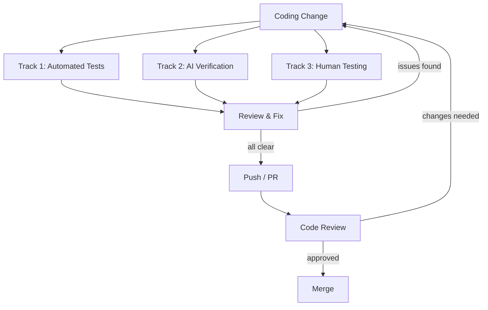

# Testing AI-Driven Development - Doer-Verifier Workflow

> For AI-driven test plan generation, see /goat-test. This playbook is the manual/multi-agent methodology.

The coding agent is the **doer**. Testing uses independent **verifiers** - automated suites, separate AI agents, and the developer - to catch what the doer missed. Never trust the coding agent's self-assessment.



---

## When to Test

Test after every milestone or every 30–60 minutes of coding agent work, whichever comes first. Run all three tracks in parallel.

**Rule:** The coding agent should never run longer than the developer is willing to test. If you're not testing, the agent shouldn't be coding. Don't let it run unsupervised for extended periods.

---

## Track 1 - Automated Tests

Run the project's existing test suite. This is the fastest feedback loop.

1. **Preflight checks** - linting, type checking, formatting (`preflight-checks.sh` or equivalent)
2. **Unit + integration tests** - the project's standard test command
3. **E2E tests** - if the project has them, run the quick suite first
4. **Scenario/demo tests** - run the full batch or a random sample. Export results for the review phase

**What this catches:** Regressions, type errors, broken contracts, failing assertions.

**What this misses:** UX issues, logic errors that tests don't cover, architectural problems, subtle behaviour changes.

---

## Track 2 - AI Verification

Use a **separate, fresh AI agent** (not the coding agent) to verify the work. This agent has no context about what "should" have changed - it reviews what actually changed.

### 2a. Functional verification (interactive)

Open a fresh AI session (browser, separate CLI instance, or different agent) and test the system as a user would. Don't follow the coding agent's test plan - approach it independently.

Example prompt for the verifier agent:
> "Manually test this system from a user perspective. Don't follow any existing test scripts - I want you to explore naturally and report anything that feels wrong, broken, or unexpected."

Verifier prompt template (fill in the blanks):
```
Test [PROJECT_NAME] as an end user. The developer changed [CHANGES].
Focus on [AREAS]. Report anything broken, unexpected, or unclear.
Do not modify any code or files. Do not follow any existing test scripts.
```

### 2b. Code review (read-only)

In a separate terminal, open a fresh agent and prompt it to review the changes without modifying anything.

Example prompt for the reviewer agent:
> "Deeply review the code changes since the last commit/milestone. Look for blockers, regressions, security issues, or anything important that should be changed before merging. Don't make any code or file changes."

Reviewer prompt template (fill in the blanks):
```
Review the code changes since [LAST COMMIT/MILESTONE]. Focus on:
[AREAS OF CHANGE]. Look for regressions, security issues, logic gaps,
or architectural concerns. Do not make any code changes - review only.
```

**Multi-model verification (recommended):** When possible, use a DIFFERENT model for Track 2 verification than the coding agent used. Claude reviewing Codex's work catches different issues than Claude reviewing Claude's work. Model-specific blind spots are real - cross-model verification catches them.

**What this catches:** Logic gaps the coding agent was blind to, architectural issues, security problems, inconsistencies between what was asked and what was built.

**What this misses:** Visual/UX issues that require a browser, performance under real load, environment-specific bugs.

---

## Track 3 - Human Testing

The developer manually tests the changes. Focus on what automated tests and AI agents can't easily verify.

1. **Ask the coding agent** for manual testing instructions for all changes it made
2. **Test each item** and note anything unacceptable
3. **Focus on:** visual correctness, UX flow, edge cases you know about from domain knowledge, anything that "feels off"

**What this catches:** UX issues, visual bugs, domain-specific edge cases, "this technically works but isn't what I wanted."

**What this misses:** Regressions in areas you didn't manually check (that's what Track 1 is for).

---

## Review & Fix

Once all three tracks complete:

1. **Collect findings** from all tracks into a single list
2. **If fixes needed**, ask the coding agent to create a fix plan:
   - What needs to change
   - Which fixes can run in parallel (sub-agents)
   - Which model/agent is best suited for each fix
3. **Review the fix plan** before executing - don't let the agent self-direct fixes
4. **Execute fixes**, then re-run all three tracks (abbreviated - focus on the areas that were fixed)

---

## Code Review (after push, before merge)

1. Run automated PR review (Copilot, Claude, or your team's tool)
2. Feed the review to the coding agent: "Here is a PR code review. Do you agree with any of these findings?"
3. Review the PR comments yourself while waiting
4. If changes needed, loop back through the three tracks

---

## Milestone Gate

A milestone is complete when:

- [ ] All plan tasks ticked off (verified by a fresh agent, not the coding agent)
- [ ] All three testing tracks passed
- [ ] Fix cycle completed (if findings were found)
- [ ] Results recorded (issue tracker, PR, or commit message)

---

## Cadence Summary

| Phase | Who | Duration |
|-------|-----|----------|
| Coding | Agent (doer) | ~30 min or 1 milestone |
| Testing | Automated + AI + Human (verifiers) | ~30 min, all three in parallel |
| Review & Fix | Agent fixes, developer reviews | Until clean |
| Code Review | Separate agent + developer | Before merge |

The verification ratio scales with the autonomy tier of the changes being made:

| Autonomy Tier | Verification Ratio | Rationale |
|--------------|-------------------|-----------|
| Never / Ask First work | 1:1 or higher | High-risk changes need thorough verification |
| Always work | 1:3 (one unit verification per three units coding) | Low-risk, reversible changes with good test coverage |

The old 1:1 ratio was too conservative for low-risk work and too aggressive for high-risk work. Map verification effort to the autonomy tier of the changes being made.
